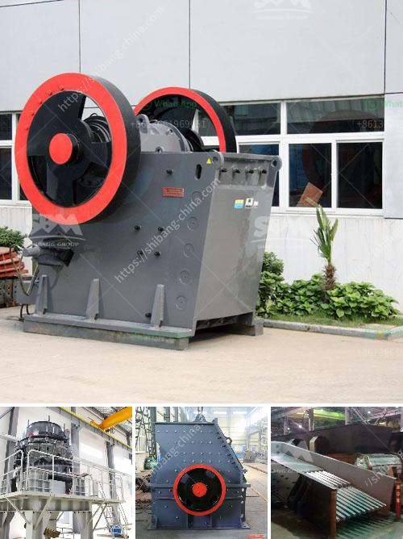

<h3>used carbon grinding production line</h3>
When it comes to enhancing carbon grinding processes, businesses often search for cost-effective and environmentally sustainable solutions. One such approach gaining popularity is the utilization of used carbon grinding production lines. This article explores the advantages and considerations associated with implementing these systems in industries worldwide.

Investing in a brand-new carbon grinding production line can be a daunting and expensive undertaking. However, opting for a used production line offers a significantly more affordable solution without compromising on quality. This choice enables businesses to acquire machinery and equipment that has already proven its capability and reliability, reducing the initial investment. Moreover, the cost savings from purchasing pre-owned equipment can be redirected towards other crucial aspects of business operations, such as maintenance, personnel training, or research and development.

In today's global landscape, promoting sustainable practices has become a top priority. By opting for a used carbon grinding production line, industries can contribute to environmental preservation. Repurposing machinery and reducing the need for new manufacturing helps minimize carbon emissions, fossil fuel consumption, and material waste associated with the production of new equipment. Furthermore, recycling and reusing existing machinery and materials fosters a circular economy model, reducing landfill waste and conserving natural resources.

One concern businesses may have when considering used production lines is the potential decrease in quality or reliability. However, reputable sellers of used machinery ensure a stringent refurbishment process, including cleaning, inspection, and replacement of worn-out components. This meticulous approach helps restore the equipment's optimal functionality and performance. Additionally, by purchasing from reliable sources, businesses can enjoy added benefits such as warranty periods, technical support, and access to spare parts, providing ongoing peace of mind.

Used carbon grinding production lines often come with the advantage of flexibility and customization. Pre-owned machinery can be adapted or modified according to specific requirements, ensuring an excellent fit for different production processes. This flexibility allows businesses to design their carbon grinding production line based on their individual product specifications, resulting in increased efficiency, improved quality control, and ultimately, higher customer satisfaction.

In the pursuit of cost-efficiency and sustainability, businesses around the world are discovering the merits of used carbon grinding production lines. This approach offers a practical and environmentally conscious alternative, allowing companies to benefit from affordable investment, while contributing to a more circular economy. By embracing these pre-owned systems, industries unlock opportunities for success without sacrificing quality or reliability.
<h3>Contact us</h3><ul><li><strong>Whatsapp:&nbsp;<a href="https://wa.me/8613661969651">+8613661969651</a></strong></li><li><a href="https://swt.shibang-china.com/?git&amp;zhl&amp;used carbon grinding production line"><strong>Online Service(chat now)</strong></a></li></ul><h3>Related</h3><ul><li><a href='supplier of jaw crusher in south africa.md'>supplier of jaw crusher in south africa</a></li><li><a href='complete stone crusher set.md'>complete stone crusher set</a></li><li><a href='station mobile de lavage de diamants.md'>station mobile de lavage de diamants</a></li><li><a href='130 150 jaw crusher.md'>130 150 jaw crusher</a></li><li><a href='finley power screen equipment.md'>finley power screen equipment</a></li></ul>