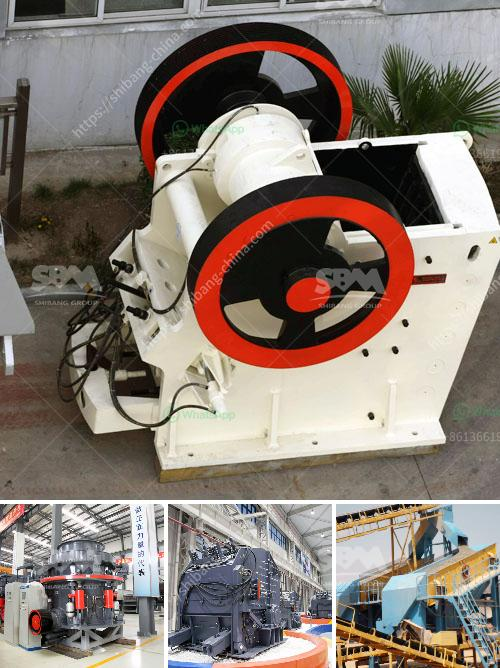

<h3>used cement clinker grinding plant</h3>
The importance of the cement industry cannot be underestimated as it plays a vital role in infrastructure development. Cement is a key ingredient in the construction industry, used in the manufacturing of buildings, roads, bridges, and other vital structures. To produce cement, clinker, a key component, is ground into a fine powder. And in the pursuit of sustainability and cost efficiency, the used cement clinker grinding plant has emerged as a key solution.

A used cement clinker grinding plant refers to the second-hand cement plant, the main process includes clinker crushing, clinker grinding, and clinker homogenization. The used cement clinker grinding plant is more economical and environmentally friendly than the new grinding plant. So, if you are eager to upgrade your cement plant without spending too much money, the used cement clinker grinding plant might be the best choice for you.

What are the benefits of a used cement clinker grinding plant? Firstly, it brings cost efficiency. By opting for a used plant, you can save a significant amount of money on upfront costs, as the price of a used plant is generally lower than that of a new plant. Moreover, the used plant may already have the necessary equipment and infrastructure in place, so you can avoid additional expenses associated with building or expanding a new plant. This cost-effectiveness makes it an attractive option for cement manufacturers looking to maximize their return on investment.

In addition to the cost advantage, a used cement clinker grinding plant also has environmental benefits. As the plant has already been in operation, it has undergone the necessary testing and obtained the required permits. This means that you can avoid lengthy and costly environmental assessment processes that are typically associated with new plant construction. By utilizing an existing plant, you can contribute to a more sustainable future by recycling and reusing infrastructure.

Choosing a reliable supplier of used cement clinker grinding plants is essential to ensure the quality and performance of the plant. You need to conduct a thorough assessment of the plant's condition and inspect the key equipment to ensure its functionality. It is also recommended to collaborate with a supplier who can provide technical support, spare parts, and maintenance services to ensure the smooth operation of the plant.

In conclusion, a used cement clinker grinding plant offers significant advantages for cement manufacturers in terms of cost-efficiency and environmental impact. By opting for a used plant, you can save on upfront costs and avoid lengthy environmental assessment processes. However, it is crucial to partner with a reliable supplier to ensure plant quality and performance. With the right choice, a used cement clinker grinding plant can be a valuable investment for cement manufacturers seeking to upgrade their operations.
<h3>Contact us</h3><ul><li><strong>Whatsapp:&nbsp;<a href="https://wa.me/8613661969651">+8613661969651</a></strong></li><li><a href="https://swt.shibang-china.com/?git&amp;zhl&amp;used cement clinker grinding plant"><strong>Online Service(chat now)</strong></a></li></ul><h3>Related</h3><ul><li><a href='best cone crusher.md'>best cone crusher</a></li><li><a href='silica sand crusher suppliers toronto.md'>silica sand crusher suppliers toronto</a></li><li><a href='supplier for crusher.md'>supplier for crusher</a></li><li><a href='ball mill pulverizer price.md'>ball mill pulverizer price</a></li><li><a href='clinker grinding unit.md'>clinker grinding unit</a></li></ul>