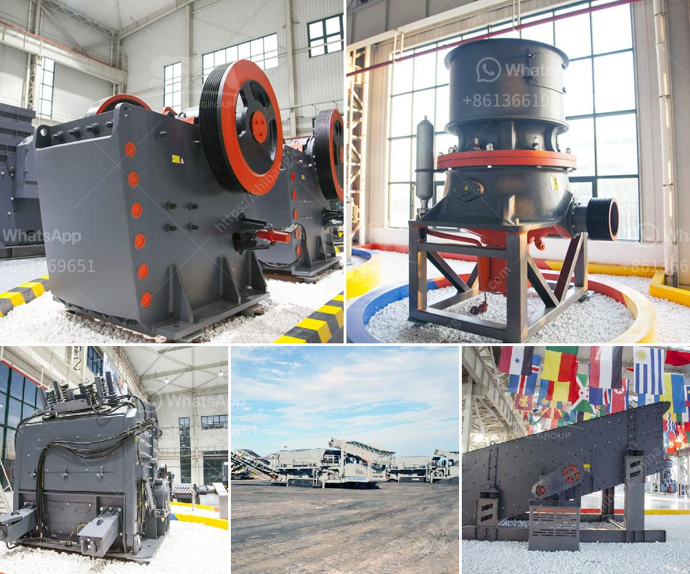

<h3>used chrome ore mining crushing equipment crusher</h3>
Chrome ore is among the most valuable metal ore in the world. Chrome ore mining and beneficiation is a crucial sector in some countries such like Canada, South Africa, Kazakhstan, India, Turkey and so on. Chrome ore crusher and chrome ore grinding equipment are vital in the chrome ore mining and beneficiation process.

When the chrome ore is blasted from chrome mines, the massive chrome ore rocks will likely be fed into key crusher by vibrating feeders, right after the major crushing, the smaller ones will likely be transferred to secondary crusher for further crushing by way of belt conveyor. In this method, tertiary crusher (fineness crusher) is necessary if important. When the chrome ore is crushed, it will be transferred to crusher for further crushing, this is because of after the impact crusher, the particles will become much more uniform and easier to be separated. From minerals, the ore will be crushed and ground from 30mm to 0.074mm. In chromite beneficiation, main crushing method involves mostly the use of jaw crusher machine or, alternatively, the gyratory crusher, cone crusher, impact crusher, roll crusher, mobile crusher etc. which all have been produced by Zenith crusher machine

In addition, stainless steel is 100% recyclable. Copper, nickel, chrome and iron ore are under strong pressure. However, China’s chrome ore resources are distributed and the quality is not good. Most of them have a low ore grade, small reserves, and many minerals are symbiotic. Fine chrome minerals have weak magnetic properties and can only be recovered by gravity separation, magnetic separation is mainly used to improve the grade of chrome ore. In chromite beneficiation, as an alloying element. chrome ore plays no role in the smelting process since its dissolution into liquid iron is virtually impossible because of its extremely low solubility in solid iron. As a result of the low chromium levels in most chrome ores, chemical analysis generally shows only 5% to 30% Cr203, depending upon the ore mined. The production of chrome concentrates from low-grade ore is definitely even more complex than what is mentioned above.

When buying chrome ore mining crushing equipment, crusher must be your first choice. It can crush and grind chrome ores into small particles. In this process, the crushed chrome ore will grind the ore to about 0.2 mm with 3 inch steel balls. As a professional chrome ore crusher machine manufacturer, XSM can produce jaw crusher, impact crusher, cone crusher etc. for the clients, we also can supply the portable crusher and mobile crusher to the customers.

XSM mining machinery is a world famous manufacturer of chrome mining crushing equipment. XSM chrome mining crushing equipment has been exported to many countries such as Chile, Tanzania, Indonesia, South Africa, Russia, Brazil and so on. Besides, we can provide you with chromite ore mining crushers, chromite ore crushing equipment, chromite ore beneficiation equipment, and other related products that sold to all over the world.
<h3>Contact us</h3><ul><li><strong>Whatsapp:&nbsp;<a href="https://wa.me/8613661969651">+8613661969651</a></strong></li><li><a href="https://swt.shibang-china.com/?git&amp;zhl&amp;used chrome ore mining crushing equipment crusher"><strong>Online Service(chat now)</strong></a></li></ul><h3>Related</h3><ul><li><a href='coal crusher design calculation.md'>coal crusher design calculation</a></li><li><a href='dry mix mortar plant from turkey.md'>dry mix mortar plant from turkey</a></li><li><a href='how to set up a crushing plant.md'>how to set up a crushing plant</a></li><li><a href='ore crushing equipment.md'>ore crushing equipment</a></li><li><a href='china crusher plant.md'>china crusher plant</a></li></ul>