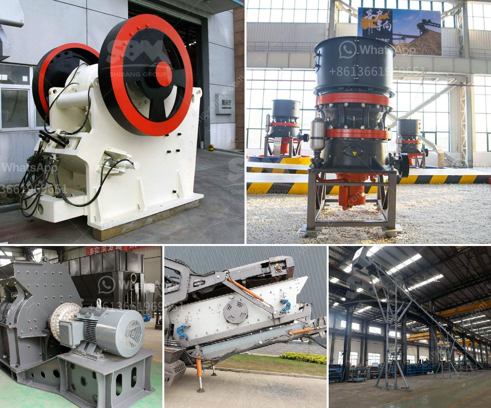

<h3>used clay grinder for sale in tamilnadu</h3>
Tamil Nadu, famous for its rich cultural heritage and traditional craftsmanship, is home to a thriving pottery industry. Clay grinders are integral to this art form, transforming raw clay into fine powder, enabling artists to create exquisite pottery items. This article explores the advantages of purchasing used clay grinders in Tamil Nadu, providing insights into affordability, sustainability, and availability.

Investing in used clay grinders offers a cost-effective solution for budding potters and established artisans alike. Compared to purchasing new equipment, used clay grinders are often available at a significantly lower price point. This affordability eases the financial burden on artists and facilitates their entry into the pottery industry. By opting for pre-owned grinders, creative individuals can allocate their budget towards obtaining quality clay and other essential pottery supplies, enhancing their productivity and artistic expression.

The purchase of used clay grinders embraces sustainable practices by giving these machines a new lease of life. In a world where resources are depleting rapidly, reusing and recycling equipment is crucial. By diverting used grinders from landfill sites, we reduce waste and the strain on our environment. Moreover, buying second-hand clay grinders is an eco-friendly step towards reducing manufacturing demands and conserving energy. Supporting the circular economy helps to minimize carbon emissions associated with production processes. Choosing used clay grinders aligns with the ethos of sustainability, contributing to a greener future for Tamil Nadu and the pottery industry as a whole.

Tamil Nadu has a vibrant and dynamic pottery community with many local artisans. Consequently, the availability of used clay grinders in the market is relatively high. Art supply stores, online marketplaces, and pottery workshops are excellent sources for finding these machines. The ease of access to second-hand grinders allows artists to acquire a crucial tool for their craft promptly. Whether you're a potter starting your journey or an experienced individual looking to expand your workshop, purchasing used clay grinders in Tamil Nadu offers a convenient and feasible solution to meet your pottery needs.

Embracing the purchase of used clay grinders in Tamil Nadu comes with several advantages, including affordability, sustainability, and availability. By acquiring pre-owned equipment, artists can flourish in their craft while reducing costs, contributing to a greener environment, and benefiting from a thriving local pottery community. May the clay grinder serve as a catalyst for endless artistic possibilities in Tamil Nadu's pottery realm.
<h3>Contact us</h3><ul><li><strong>Whatsapp:&nbsp;<a href="https://wa.me/8613661969651">+8613661969651</a></strong></li><li><a href="https://swt.shibang-china.com/?git&amp;zhl&amp;used clay grinder for sale in tamilnadu"><strong>Online Service(chat now)</strong></a></li></ul><h3>Related</h3><ul><li><a href='basalt stone processing plant.md'>basalt stone processing plant</a></li><li><a href='used chrome ore mining crushing equipment crusher.md'>used chrome ore mining crushing equipment crusher</a></li><li><a href='stone crusher machine china.md'>stone crusher machine china</a></li><li><a href='granite crushing per tonne.md'>granite crushing per tonne</a></li><li><a href='fairly used quarry crusher in nigeria price.md'>fairly used quarry crusher in nigeria price</a></li></ul>