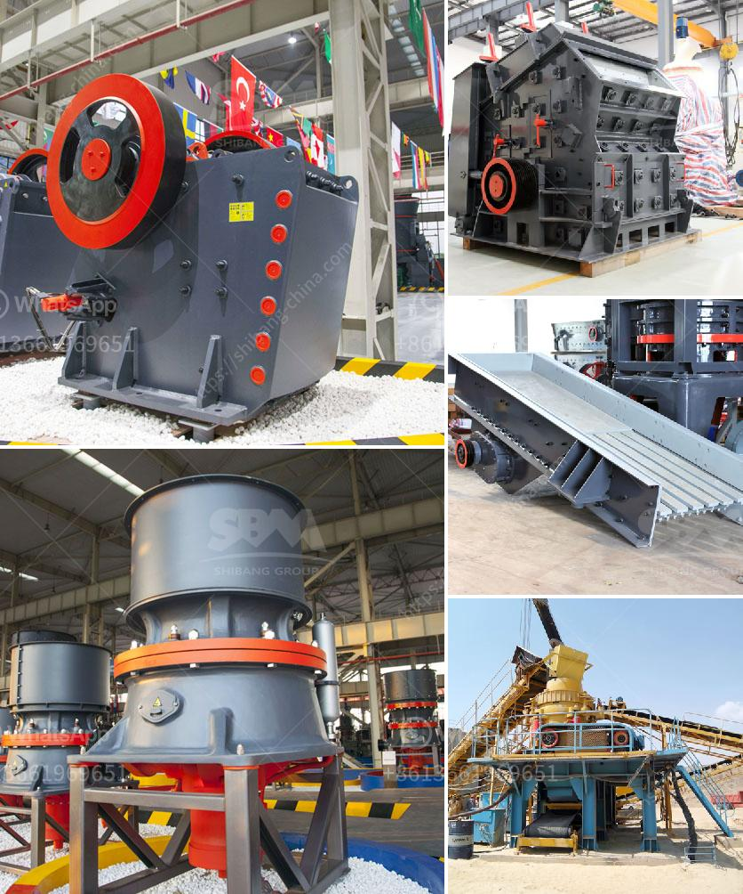

<h3>used cone crushers zambia</h3>
Used cone crushers are a popular option in Zambia, as they provide greater flexibility and efficiency in crushing and screening processes. The country's robust mining industry is flourishing, and this has led to an increase in the use of cone crushers. As a result, there is a significant market for these crushers in Zambia.

Cone crushers are machines that utilize a compression mechanism to reduce large rocks into smaller particles. They have a conical-shaped head, which rotates eccentrically within a fixed concave surface. The material is fed through the top of the machine and is crushed between the mantle and the concave surface. The crushed material is then discharged at the bottom of the machine.

One of the main advantages of cone crushers is their versatility. They can be used in various applications, such as mining, quarrying, and recycling. In mining operations, cone crushers are used to crush ore into smaller particles, which can then be processed further. In quarrying, cone crushers are used to crush stones and rocks into aggregates for construction purposes. Additionally, cone crushers are also used in recycling operations to crush and reuse concrete and asphalt.

Another advantage of cone crushers is their efficiency. Compared to other types of crushers, cone crushers have a higher crushing ratio, meaning that a smaller amount of energy is required to crush the same amount of material. This translates to lower operating costs and improved overall productivity. Additionally, cone crushers have a larger feed opening, which allows them to process larger rocks and produce more uniform and consistent particles.

Used cone crushers in Zambia are in high demand due to their reliability and durability. Many mining operations in the country rely on cone crushers, ensuring that they are able to process large amounts of ore efficiently. Moreover, cone crushers are also popular in Zambia's construction industry, where they are used to crush stones and rocks into aggregates for various construction projects.

When considering buying a used cone crusher in Zambia, it is essential to conduct thorough research and inspection. The most critical factors to consider are the condition of the machine, its maintenance history, and its overall performance. It is advisable to engage with a reputable dealer or seller who can provide comprehensive information about the cone crusher's maintenance and usage.

In conclusion, used cone crushers are widely used in Zambia due to their versatility, efficiency, and durability. They have become a go-to option for mining and construction industries in the country. When considering purchasing a used cone crusher, one should always prioritize researching and inspecting the machine thoroughly to ensure that it meets the necessary requirements for the desired application.
<h3>Contact us</h3><ul><li><strong>Whatsapp:&nbsp;<a href="https://wa.me/8613661969651">+8613661969651</a></strong></li><li><a href="https://swt.shibang-china.com/?git&amp;zhl&amp;used cone crushers zambia"><strong>Online Service(chat now)</strong></a></li></ul><h3>Related</h3><ul><li><a href='jaw crusher in china.md'>jaw crusher in china</a></li><li><a href='gypsum crushing machine for sale india.md'>gypsum crushing machine for sale india</a></li><li><a href='how to disassemble a cone crusher.md'>how to disassemble a cone crusher</a></li><li><a href='5mm limestones grinding to powder.md'>5mm limestones grinding to powder</a></li><li><a href='manufacturer of jaw crusher.md'>manufacturer of jaw crusher</a></li></ul>