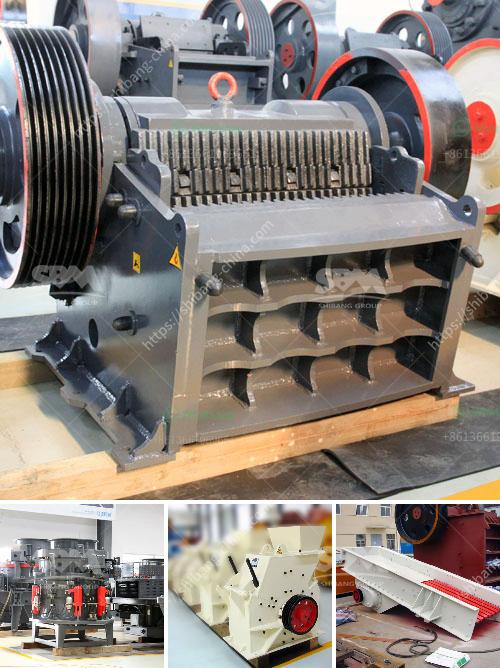

<h3>used crusher machines in sweden</h3>
Sweden is a country known for its booming machine industry. In recent years, the country has experienced a significant increase in the use of crusher machines in various industries. Here, we will take a closer look at the used crusher machines available in Sweden.

Crushers are widely used in the mining, construction, and recycling industries. They are commonly used to break down large rocks into smaller, more manageable pieces. The demand for crushers has grown steadily in Sweden, especially with the increase in infrastructure projects and the need to recycle materials.

One of the reasons why used crusher machines are popular in Sweden is the cost-effectiveness they offer. Buying a used crusher machine can significantly reduce the initial investment required compared to buying a new one. This is especially beneficial for small businesses or startups that have limited budgets but still require quality equipment.

Used crusher machines also provide an opportunity for businesses to try different models or types of crushers without committing to a long-term investment. By purchasing a used machine, businesses can understand the performance and capabilities of different models before deciding to invest in a brand new crusher.

Moreover, buying used crusher machines in Sweden is relatively easy due to the country's strong machine market. There are numerous suppliers and dealers specializing in the sale of used crushers. These suppliers often provide detailed information about the condition, usage history, and maintenance of the machines they offer, giving buyers a clear idea of what they are purchasing.

Additionally, the used crusher machine market in Sweden offers plenty of options in terms of brands and models. Some popular crusher brands available in Sweden include Metso, Sandvik, and Svedala. Each brand offers a range of crushers suitable for various applications, ensuring that buyers can find the right machine to meet their specific needs.

Another advantage of purchasing used crusher machines in Sweden is that these machines are often well-maintained. Sweden has strict regulations regarding machinery maintenance and inspections, ensuring that used machines in the market are in good working condition. Buyers can trust that the machines they purchase have been properly cared for and are ready to use.

In conclusion, the market for used crusher machines in Sweden is thriving due to the cost-effectiveness, variety of options, and trust in the quality of these machines. Small businesses and startups can benefit from purchasing used crushers as they offer a more affordable option without compromising on performance. With a strong machine industry and an abundance of suppliers, buyers can easily find the right crusher machine to meet their needs. Whether it's for mining, construction, or recycling, used crushers are a reliable and cost-effective solution in the Swedish market.
<h3>Contact us</h3><ul><li><strong>Whatsapp:&nbsp;<a href="https://wa.me/8613661969651">+8613661969651</a></strong></li><li><a href="https://swt.shibang-china.com/?git&amp;zhl&amp;used crusher machines in sweden"><strong>Online Service(chat now)</strong></a></li></ul><h3>Related</h3><ul><li><a href='enquiry about sand making machine.md'>enquiry about sand making machine</a></li><li><a href='best jaw crusher for making stone.md'>best jaw crusher for making stone</a></li><li><a href='horizontal stone ball mill.md'>horizontal stone ball mill</a></li><li><a href='amenagement de station de concassage de 300 tonnes.md'>amenagement de station de concassage de 300 tonnes</a></li><li><a href='stone quarries cursher south africa.md'>stone quarries cursher south africa</a></li></ul>