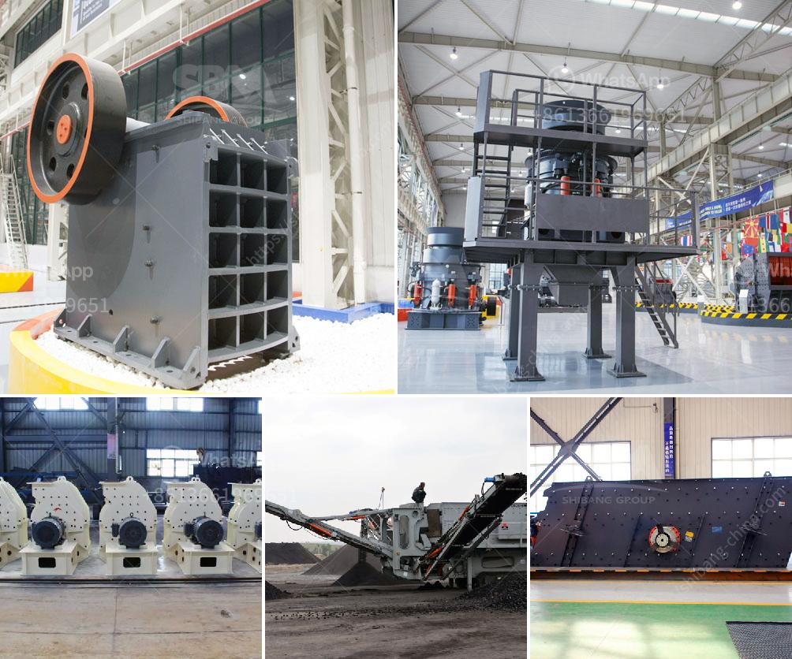

<h3>used crushing machine price</h3>
In various industries like mining, construction, and recycling, crushing machines play a fundamental role in extracting and processing raw materials. However, purchasing new crushing equipment can be a significant financial burden for many businesses, especially for small-scale operations or those operating on tight budgets. This is where used crushing machines come into the picture, offering a practical and cost-effective solution. In this article, we will explore the advantages of buying used crushing machines and the price range one can expect in the market.

First and foremost, purchasing used crushing machines can lead to substantial cost savings. Compared to brand new equipment, used machines are generally priced at a fraction of the cost. This affordability allows businesses to allocate their financial resources to other critical areas or invest in additional machinery needed for their operations. Consequently, buying used crushing machines enables businesses to achieve production goals without compromising on quality or incurring excessive expenses.

Another advantage of buying used crushing machines is their availability. With the advancement of technology and wide-scale machinery deployments worldwide, the market for used equipment has expanded significantly. This means that businesses have a broad selection of machines to choose from, ensuring they can find the perfect fit for their specific needs and requirements. Whether it's a jaw crusher, cone crusher, or impact crusher, one can easily find a used machine that matches the desired specifications and capacity.

Furthermore, purchasing used crushing machines allows businesses to access top-quality machinery at a reduced price. Many machines available on the used market are of reputable brands and have been well-maintained by their previous owners. This ensures that the machines are in good working condition and can deliver reliable performance. By evaluating the machine's condition and maintenance history, businesses can make informed decisions and select machines that will provide optimal results.

The price range of used crushing machines can vary depending on various factors. These factors include the type of machine, its age, condition, and the location where it is being sold. Generally, the price range for used crushing machines can start from a few thousand dollars and go up to several hundred thousand dollars. However, it is important to note that prices may also fluctuate depending on supply and demand dynamics and the overall market conditions.

To ensure the best value for money, potential buyers of used crushing machines should consider a few key factors. First and foremost, it is crucial to inspect the machine thoroughly, either in person or through a trusted third-party inspection service, to assess its condition accurately. Additionally, it is advisable to inquire about the machine's maintenance history and any relevant certifications. Lastly, buyers should consult with reputable sellers or dealers who have a proven track record of providing reliable and quality used crushing machines.

In conclusion, used crushing machines offer a practical and cost-effective solution for businesses operating in industries that require heavy machinery. The cost savings, availability of a wide selection, and access to top-quality machinery make purchasing used equipment an attractive option. By identifying their specific needs and evaluating the machine's condition, buyers can find the perfect used crushing machine to meet their requirements while staying within their budget.
<h3>Contact us</h3><ul><li><strong>Whatsapp:&nbsp;<a href="https://wa.me/8613661969651">+8613661969651</a></strong></li><li><a href="https://swt.shibang-china.com/?git&amp;zhl&amp;used crushing machine price"><strong>Online Service(chat now)</strong></a></li></ul><h3>Related</h3><ul><li><a href='stasioner stone crusher.md'>stasioner stone crusher</a></li><li><a href='gypsum board preparation process.md'>gypsum board preparation process</a></li><li><a href='concrete batching plant for sale in pakistan.md'>concrete batching plant for sale in pakistan</a></li><li><a href='amenagement de station de concassage de 300 tonnes.md'>amenagement de station de concassage de 300 tonnes</a></li><li><a href='kenya granite stone crushing plant.md'>kenya granite stone crushing plant</a></li></ul>