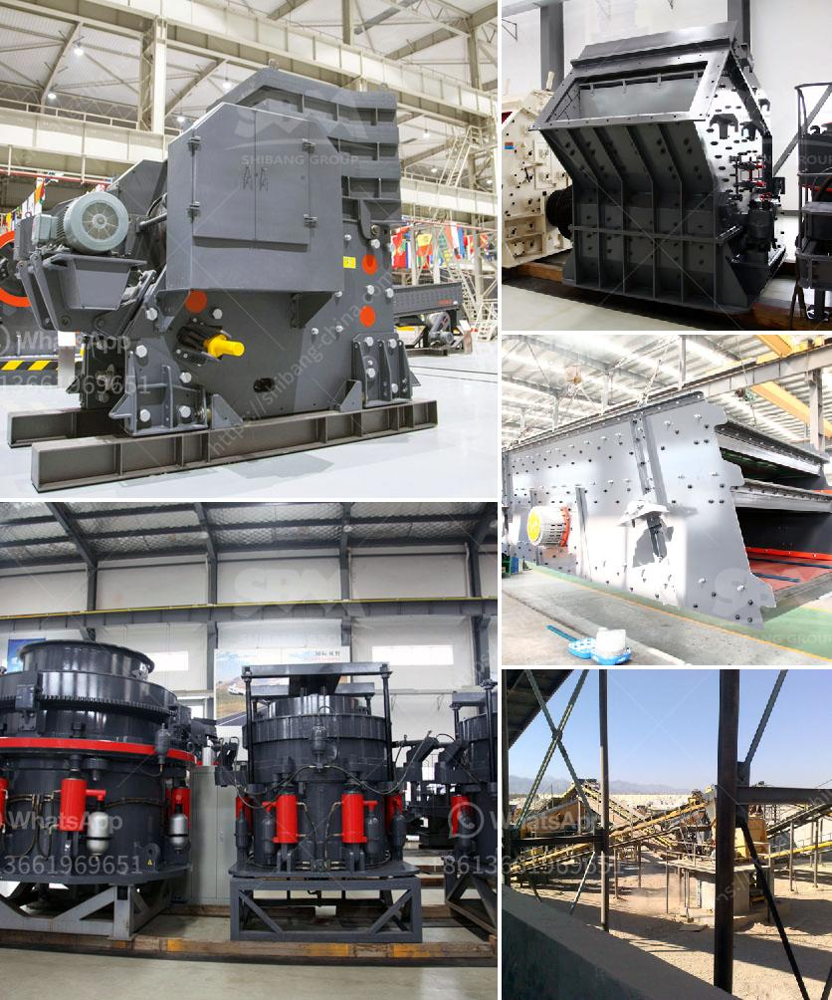

<h3>used gold stamp mill for sale in south africa</h3>
The gold stamp mill is a crucial piece of equipment for gold miners in South Africa. Many gold stamp mills have been created over the years, enabling miners to crush gold-bearing rock material into fine powder. This powder is then processed to extract the valuable gold nuggets.

In South Africa, stamp mills were mostly used to crush gold-bearing quartz rock in order to extract the gold. The ground-up material is mixed with water to create a slurry, which is then mixed further with mercury. The gold particles in the slurry bond with the mercury to form an amalgam, which is then heated to evaporate the mercury, leaving behind pure gold.

However, as technology advanced and more efficient methods of gold extraction were developed, the need for stamp mills diminished. Consequently, many stamp mills fell into disuse and were abandoned. Today, these once vibrant stamp mills can be found scattered throughout South Africa, often in remote and isolated locations.

However, some of these historic stamp mills have been refurbished and are now available for sale. These used stamp mills are a valuable part of South Africa's mining history and can still be used to crush and process gold-bearing material. These machines are affordable and can be a great addition to any mining operation.

There are several benefits to purchasing a used stamp mill. Firstly, they are a more cost-effective option compared to purchasing a new stamp mill. Secondly, buying a used stamp mill helps preserve South Africa's rich mining heritage. Lastly, these machines are reliable and durable, and when properly maintained, can still deliver excellent results.

If you are in the mining industry, or simply have an interest in South Africa's gold mining history, consider investing in a used gold stamp mill. Not only will it assist you in extracting gold from rocks but it will also allow you to connect with the rich heritage of the country's mining industry. So why not explore the options and bring a piece of history into your mining operation?
<h3>Contact us</h3><ul><li><strong>Whatsapp:&nbsp;<a href="https://wa.me/8613661969651">+8613661969651</a></strong></li><li><a href="https://swt.shibang-china.com/?git&amp;zhl&amp;used gold stamp mill for sale in south africa"><strong>Online Service(chat now)</strong></a></li></ul><h3>Related</h3><ul><li><a href='iron ore process crushing.md'>iron ore process crushing</a></li><li><a href='earth moving equipment duty free in zimbabwe.md'>earth moving equipment duty free in zimbabwe</a></li><li><a href='price list of stone crusher in india.md'>price list of stone crusher in india</a></li><li><a href='ball mill projects for slag in india.md'>ball mill projects for slag in india</a></li><li><a href='price of ballast per ton in kenya.md'>price of ballast per ton in kenya</a></li></ul>