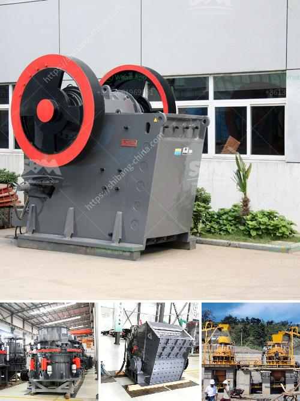

<h3>used granite machines for sale cone crusher stone crusher</h3>
Granite is one of the most popular materials used in construction and decoration. With its unique beauty and durability, it has become a preferred choice for various applications, including countertops, flooring, and walls. To meet the increasing demand for granite, many manufacturers and suppliers offer used granite machines for sale, including cone crushers and stone crushers.

Cone crushers are commonly used in the mining and aggregates industry to crush various materials with high hardness. Some cone crushers are equipped with an automatic setting system, known as the hydraulic tramp release system (HP Series Cone Crusher Tramp Release System). This allows the cone crusher to operate at its full potential by continuously adjusting the closed side setting to compensate for liner wear, ensuring consistent product size and increasing the crusher's overall capacity.

Stone crushers are machines used to crush large stones into smaller rocks, gravel, or rock dust. They are commonly used in construction, mining, and recycling industries. The primary objective of a stone crusher is to reduce the size of the stone and enhance its shape and quality by breaking it down into smaller pieces. Stone crushers come in different types, including jaw crushers, cone crushers, impact crushers, and gyratory crushers.

When searching for used granite machines for sale, it is essential to consider several factors to ensure that you choose the right equipment for your specific needs and budget. Firstly, assess the condition of the machine. Look for any signs of wear or damage, as this may affect its performance and lifespan. It is also recommended to request maintenance and service records to have a better understanding of the machine's history.

Secondly, consider the specifications of the cone crusher or stone crusher. Look for information regarding its crushing capacity, power consumption, and operating conditions. These details will help you determine whether the machine is suitable for your desired application. Additionally, check whether the machine comes with any additional features or equipment that can enhance its performance and efficiency.

Thirdly, inquire about the price and payment options. Used granite machines for sale often come at a lower price compared to new ones, but it is still important to ensure that you are getting a fair deal. Compare prices from different sellers and consider negotiating for a better price if possible. Moreover, discuss the payment options available to you and choose the most convenient and secure method.

Lastly, consider the seller's reputation and customer reviews. Online marketplaces and auction websites often provide user ratings and feedback, allowing you to assess the trustworthiness and reliability of the seller. Look for positive reviews and ratings indicating previous customers' satisfaction with their purchases. Additionally, consider reaching out to the seller directly to address any concerns or questions you may have.

In conclusion, used granite machines for sale, such as cone crushers and stone crushers, offer a cost-effective and reliable solution for various granite applications. With the increasing demand for granite and the environmental impact of quarrying, recycling and reusing these machines is beneficial in reducing waste and promoting sustainability. When purchasing these machines, it is crucial to consider the condition, specifications, price, and reputation of the seller to ensure a successful and satisfactory purchase.
<h3>Contact us</h3><ul><li><strong>Whatsapp:&nbsp;<a href="https://wa.me/8613661969651">+8613661969651</a></strong></li><li><a href="https://swt.shibang-china.com/?git&amp;zhl&amp;used granite machines for sale cone crusher stone crusher"><strong>Online Service(chat now)</strong></a></li></ul><h3>Related</h3><ul><li><a href='dolomite mining crusher process.md'>dolomite mining crusher process</a></li><li><a href='cost cement plant manufacturers and cost.md'>cost cement plant manufacturers and cost</a></li><li><a href='different part of barite and bentonite mill.md'>different part of barite and bentonite mill</a></li><li><a href='crusher and screen plant for sale japan.md'>crusher and screen plant for sale japan</a></li><li><a href='how to specify a jaw crusher.md'>how to specify a jaw crusher</a></li></ul>