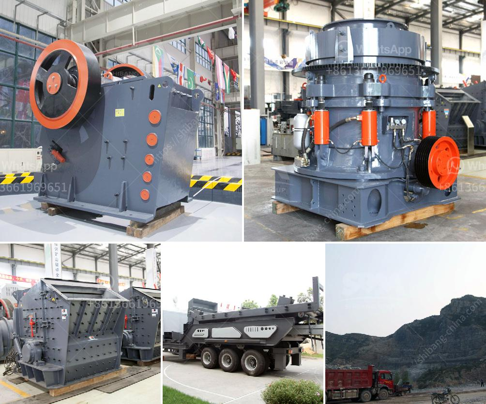

<h3>used iron ore mining equipment plantand machinery</h3>
The mining industry is definitely an important part of the world economy and its significance has been increasing over time. As iron ore is a crucial raw material for iron and steel making, companies engaged in mining and processing of iron ore are essential players in the industry.

Iron ore is mined by special machinery known as iron ore mining equipment plant. This machinery is specifically designed for iron ore deposits, making it ideal for iron ore mining in various countries. Utilizing iron ore mining equipment plant significantly increases the speed at which iron ore is extracted from the earth, increasing productivity, and reducing the time taken for the process.

Used iron ore mining equipment plants and machinery significantly reduces the initial capital investment and operational costs involved in setting up a complete iron ore mining facility. These plants and machinery may have been previously utilized by other mining companies or government institutions, and hence are available at a more reasonable price compared to new ones. This makes them an attractive option for companies looking to enter the iron ore mining industry or expand their existing facilities.

One of the significant advantages of used iron ore mining equipment plants and machinery is that they come with a certain level of reliability and durability. As these plants and machinery have been functioning in the field previously, their performance and efficiency have already been tested. This reduces the risk associated with the purchase of new equipment, where the performance and reliability are yet to be proven. In addition, used equipment is often already familiar to the operators and maintenance staff on-site, which further enhances efficiency and productivity.

There is also the environmental benefit of opting for used iron ore mining equipment plants and machinery. The production and maintenance of new equipment require a significant amount of resources, such as raw materials, energy, and water. By utilizing existing equipment, the demand for these resources is reduced, resulting in a smaller ecological footprint. Moreover, the disposal and recycling of used equipment can be managed more sustainably, thus contributing to a circular economy.

However, it is crucial to consider certain factors while purchasing used iron ore mining equipment plant and machinery. Firstly, the condition of the equipment should be thoroughly inspected to ensure that it meets the required standards and specifications. Secondly, the history of maintenance and any past repairs should be evaluated to determine the remaining lifespan of the equipment. Finally, the availability of spare parts and technical support for the used equipment must be considered to ensure its long-term functioning.

In conclusion, used iron ore mining equipment plant and machinery offer several advantages in terms of cost-effectiveness, reliability, and environmental sustainability. Companies involved in iron ore mining and processing can benefit from the significant reduction in initial investment and operational costs. However, careful evaluation of the condition and history of the equipment is required to ensure a successful and sustainable mining operation.
<h3>Contact us</h3><ul><li><strong>Whatsapp:&nbsp;<a href="https://wa.me/8613661969651">+8613661969651</a></strong></li><li><a href="https://swt.shibang-china.com/?git&amp;zhl&amp;used iron ore mining equipment plantand machinery"><strong>Online Service(chat now)</strong></a></li></ul><h3>Related</h3><ul><li><a href='clinker grinding unit.md'>clinker grinding unit</a></li><li><a href='ball mill diagram manufacturers in bangalore.md'>ball mill diagram manufacturers in bangalore</a></li><li><a href='manganese ore jaw crusher south africa.md'>manganese ore jaw crusher south africa</a></li><li><a href='vertical mill working principle of the hydraulic.md'>vertical mill working principle of the hydraulic</a></li><li><a href='ball mill machine in nigeria.md'>ball mill machine in nigeria</a></li></ul>