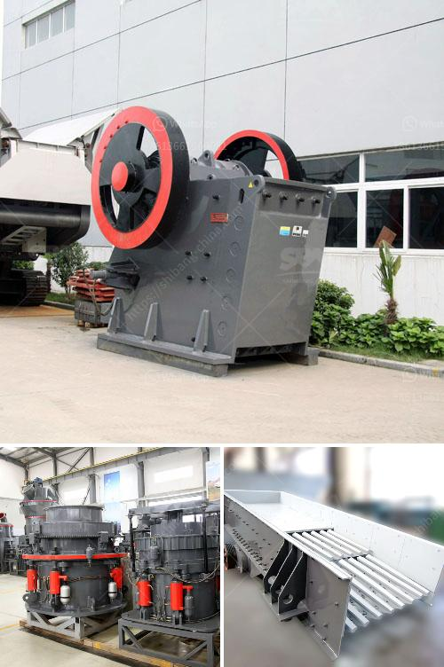

<h3>used jaw crushers for sale in florida</h3>
If you are in the market for a used jaw crusher, Florida might be a great location to explore. With its vibrant mining industry, Florida offers numerous opportunities for buyers to find used jaw crushers at affordable prices. 

Jaw crushers are essential equipment in mining and construction industries, as they break down large rocks into smaller, more manageable sizes. An efficient jaw crusher can save both time and money by reducing the need for manual labor and speeding up the crushing process.

One of the advantages of buying used jaw crushers in Florida is the variety of options available. You can choose from a wide range of makes and models, depending on your specific requirements. Additionally, Florida has a booming used equipment market, ensuring that you have ample choices to find a jaw crusher that meets your needs.

Another benefit of purchasing a used jaw crusher is cost savings. Used equipment generally comes at a lower price compared to new machinery. By opting for a used jaw crusher, you can save a significant amount of money without compromising on quality or performance.

When searching for used jaw crushers in Florida, it is essential to inspect the equipment thoroughly before making a purchase. Key factors to consider include the overall condition of the crusher, its usage history, maintenance records, and any necessary repairs or updates that may be required. Conducting a thorough inspection or hiring a professional to do so can help ensure that you make an informed decision and choose a reliable crusher.

To maximize your purchasing experience, it is advisable to work with reputable dealers or sellers who have a track record of providing quality used equipment. They can guide you through the buying process, answer your questions, and provide valuable insights into the different jaw crusher options available.

In conclusion, if you are in the market for a used jaw crusher in Florida, you have a variety of options to choose from. By exploring the vibrant used equipment market and working with reputable dealers, you can find a high-quality jaw crusher that meets your needs at an affordable price. Remember to thoroughly inspect the equipment before making a purchase to ensure its reliability and longevity.
<h3>Contact us</h3><ul><li><strong>Whatsapp:&nbsp;<a href="https://wa.me/8613661969651">+8613661969651</a></strong></li><li><a href="https://swt.shibang-china.com/?git&amp;zhl&amp;used jaw crushers for sale in florida"><strong>Online Service(chat now)</strong></a></li></ul><h3>Related</h3><ul><li><a href='how to make good with limestone powder.md'>how to make good with limestone powder</a></li><li><a href='best cone crusher.md'>best cone crusher</a></li><li><a href='used mobile stone crushers for sale.md'>used mobile stone crushers for sale</a></li><li><a href='thailand coconut processing machine.md'>thailand coconut processing machine</a></li><li><a href='ball mills brands.md'>ball mills brands</a></li></ul>