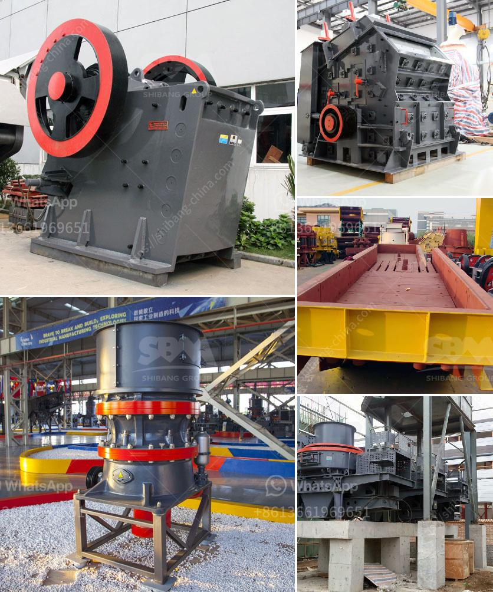

<h3>used lab scale crusher price</h3>
Lab scale crushers are an essential instrument in scientific laboratories, used for crushing different types of materials to obtain smaller particle sizes. These crushers are commonly used in fields such as geology, chemistry, metallurgy, and material science, where small samples need to be crushed for further analysis or experimentation. However, purchasing new lab scale crushers can be expensive, especially for laboratories with a limited budget. That's where used lab scale crushers come into play.

Used lab scale crushers offer a cost-effective solution for laboratories looking to acquire necessary equipment without breaking the bank. These crushers are typically pre-owned but still in good working condition, making them a viable alternative to buying new equipment. Besides the reduced price, there are several other advantages to investing in used lab scale crushers.

Firstly, used lab scale crushers can be readily available. As advancements in technology continue at a rapid pace, many laboratories find themselves upgrading their equipment regularly. This means that there is often a surplus of used lab scale crushers in the market. With a little research and due diligence, laboratories can find suitable crushers that meet their requirements at a fraction of the cost of a new one. Furthermore, this availability ensures that there is a wide range of options to choose from, making it easier to find the ideal crusher for specific needs.

Another advantage is the ability to test the crushers before purchasing. When buying new lab scale crushers, laboratories often have to rely on product specifications and seller descriptions. In contrast, buying used allows potential buyers to physically inspect and test the equipment before making a decision. This hands-on approach gives laboratories the opportunity to determine if the crusher meets their specific requirements and ensures that they are getting a reliable and functional instrument.

Used lab scale crushers also hold their value well. As long as the instrument is maintained properly, it will retain its functionality and efficiency for a considerable period. This means that laboratories can recoup a significant portion of their investment if they decide to sell the crusher later. Additionally, the resale market for lab equipment is usually strong, as there is a continuous demand for affordable alternatives in the scientific community.

However, it is essential to be cautious when purchasing used lab scale crushers. Laboratories must do their due diligence and ensure that the seller is reputable and reliable. They should inspect the equipment thoroughly, checking for any signs of damage or wear, and carefully review the specifications to ensure that it meets their specific needs. If possible, laboratories should ask for any available records related to the crusher's previous maintenance and usage.

In conclusion, purchasing used lab scale crushers provides laboratories with a cost-effective solution to meet their crushing needs. These crushers offer a reduced price compared to new equipment while still providing the necessary functionality and efficiency. Laboratories have the advantage of wider availability, the opportunity to test the crushers before purchase, and the potential for resale value. However, it is crucial for laboratories to conduct thorough research and inspection to ensure that they are buying from reputable sellers and acquiring equipment suitable for their requirements.
<h3>Contact us</h3><ul><li><strong>Whatsapp:&nbsp;<a href="https://wa.me/8613661969651">+8613661969651</a></strong></li><li><a href="https://swt.shibang-china.com/?git&amp;zhl&amp;used lab scale crusher price"><strong>Online Service(chat now)</strong></a></li></ul><h3>Related</h3><ul><li><a href='cost of setting up a cement plant in usa.md'>cost of setting up a cement plant in usa</a></li><li><a href='top mobile crusher.md'>top mobile crusher</a></li><li><a href='crusher plants south africa.md'>crusher plants south africa</a></li><li><a href='price of cone crusher.md'>price of cone crusher</a></li><li><a href='crusher operator salary in uae and dubai.md'>crusher operator salary in uae and dubai</a></li></ul>