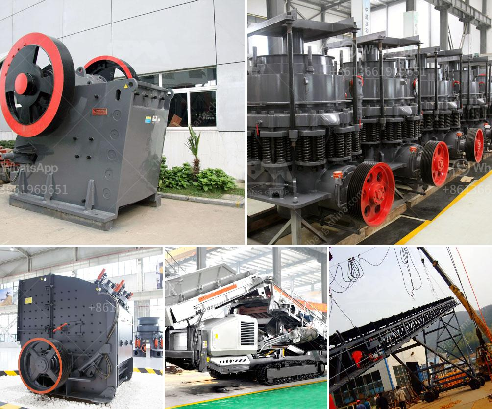

<h3>used mobile quarry equipment</h3>
Used mobile quarry equipment refers to the mining equipment that is typically used in a quarry mining operation. In a quarry, gravel and rocks are extracted from the ground and crushed to produce aggregates. These aggregates are commonly used in the construction industry for building materials like concrete and asphalt.

When it comes to mobile quarry equipment, it refers to the equipment that can be easily moved from one location to another. This mobility is particularly advantageous for quarry operations as it allows for greater flexibility in accessing different areas of the quarry. Mobile quarry equipment includes various types of crushers, screens, and conveyors that are mounted on a mobile chassis.

There are several benefits to using used mobile quarry equipment. Firstly, purchasing used equipment is a cost-effective option compared to buying brand new equipment. Quarry operations can be capital-intensive, and buying used equipment can significantly reduce the initial investment. This is especially beneficial for small and medium-sized quarry operations that may have limited budgets.

Secondly, used mobile quarry equipment is readily available in the market. Many quarry operators upgrade their equipment regularly, which means there is a constant supply of used equipment. This availability makes it easier for quarry operators to find the specific equipment they need to suit their requirements.

Moreover, used mobile quarry equipment is often well-maintained. Quarry operators maintain their equipment to ensure optimal performance and extend its lifespan. When purchasing used equipment, buyers can often find machines that are still in good condition and have been regularly serviced. This means that the equipment can be put into operation immediately, without the need for extensive repairs or maintenance.

In conclusion, used mobile quarry equipment offers a cost-effective and readily available solution for quarry operators. It provides the flexibility and mobility required in quarry operations while reducing the initial investment. With proper maintenance, used equipment can offer reliable performance, making it a practical choice for quarry operators looking to upgrade their machinery.
<h3>Contact us</h3><ul><li><strong>Whatsapp:&nbsp;<a href="https://wa.me/8613661969651">+8613661969651</a></strong></li><li><a href="https://swt.shibang-china.com/?git&amp;zhl&amp;used mobile quarry equipment"><strong>Online Service(chat now)</strong></a></li></ul><h3>Related</h3><ul><li><a href='petimex impact crushers manial petite.md'>petimex impact crushers manial petite</a></li><li><a href='limestone powder mill.md'>limestone powder mill</a></li><li><a href='crusher 50 ton per hour price.md'>crusher 50 ton per hour price</a></li><li><a href='china crushing plant.md'>china crushing plant</a></li><li><a href='cone crusher spare parts.md'>cone crusher spare parts</a></li></ul>