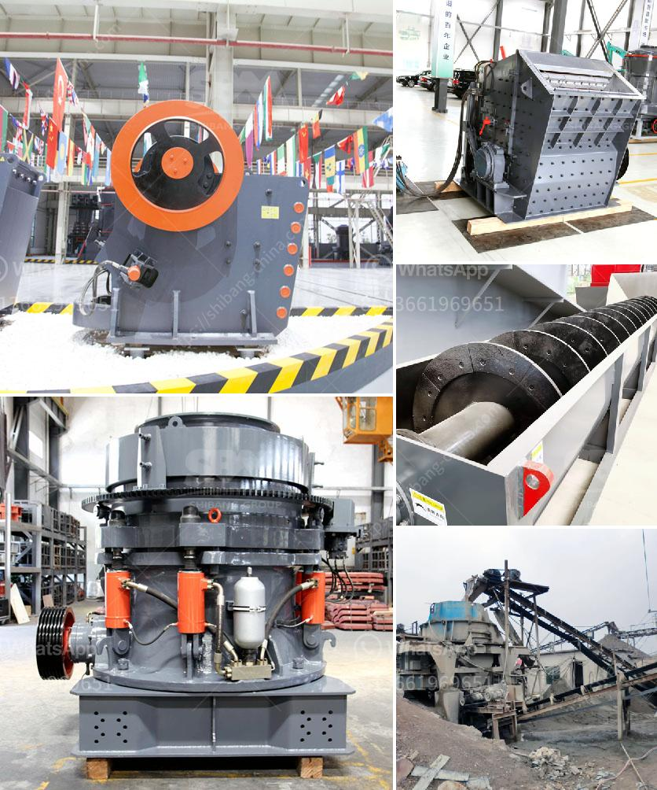

<h3>used mobile screens and crusher in africa</h3>
Mobile screens and crushers are essential tools in the quarrying and construction industries. They are the machines specifically designed to screen and crush oversized rocks, aggregates, and construction materials, providing a convenient solution for the recycling and disposal of waste products in various African countries.

Africa, a continent rich in natural resources and characterized by significant infrastructure developments, requires efficient means of processing and recycling construction waste. Used mobile screens and crushers offer an environmentally friendly and cost-effective solution to this challenge.

In recent years, the adoption of used mobile screens and crushers has become more prevalent in Africa due to their numerous advantages. Firstly, these machines offer improved flexibility and mobility compared to traditional fixed screening and crushing plants. They can be easily transported from one site to another, allowing for quick setup and dismantling. This flexibility makes them ideal for both large-scale construction projects and small-scale quarrying operations.

Furthermore, used mobile screens and crushers facilitate increased productivity and reduced downtime. With their powerful engines and high screening capacity, they enable operators to process large volumes of materials quickly and efficiently. This not only results in increased productivity but also decreases the cost of maintenance and repairs, ultimately optimizing profitability for businesses.

One of the significant advantages of using used mobile screens and crushers in Africa is their ability to recycle construction waste and save valuable natural resources. By crushing and screening construction materials such as concrete, bricks, and asphalt, these machines transform waste products into valuable resources for reuse. This not only reduces the demand for new raw materials but also lowers the carbon footprint associated with quarrying and mining activities.

Moreover, the use of used mobile screens and crushers supports local industries and fosters economic growth in African countries. As these machines are highly sought after by mining and construction companies, the demand for them has created a thriving market for used equipment. This market provides opportunities for local enterprises, including equipment dealers, rental services, and spare parts suppliers, driving employment and economic development in the region.

Although used mobile screens and crushers offer numerous advantages for Africa, their adoption still poses several challenges. The availability of these machines at affordable prices remains a concern for many businesses in the region. Additionally, limited access to spare parts and service support can hamper the operations of equipment owners. To address these challenges, collaboration between manufacturers, suppliers, and policymakers is crucial in ensuring the availability and affordability of used mobile screens and crushers.

In conclusion, used mobile screens and crushers have become game-changers in Africa's quarrying and construction industries. By offering flexibility, improved productivity, and the ability to recycle waste materials, these machines contribute to the sustainable development of the continent. With the right support and collaboration, the adoption of used mobile screens and crushers will continue to grow, driving economic growth and environmental sustainability in African countries.
<h3>Contact us</h3><ul><li><strong>Whatsapp:&nbsp;<a href="https://wa.me/8613661969651">+8613661969651</a></strong></li><li><a href="https://swt.shibang-china.com/?git&amp;zhl&amp;used mobile screens and crusher in africa"><strong>Online Service(chat now)</strong></a></li></ul><h3>Related</h3><ul><li><a href='dolomite mining crusher process.md'>dolomite mining crusher process</a></li><li><a href='copper ore separation machine.md'>copper ore separation machine</a></li><li><a href='ton grinding unit cement plant cost.md'>ton grinding unit cement plant cost</a></li><li><a href='carbon black grinding.md'>carbon black grinding</a></li><li><a href='small scale coal processing plant.md'>small scale coal processing plant</a></li></ul>