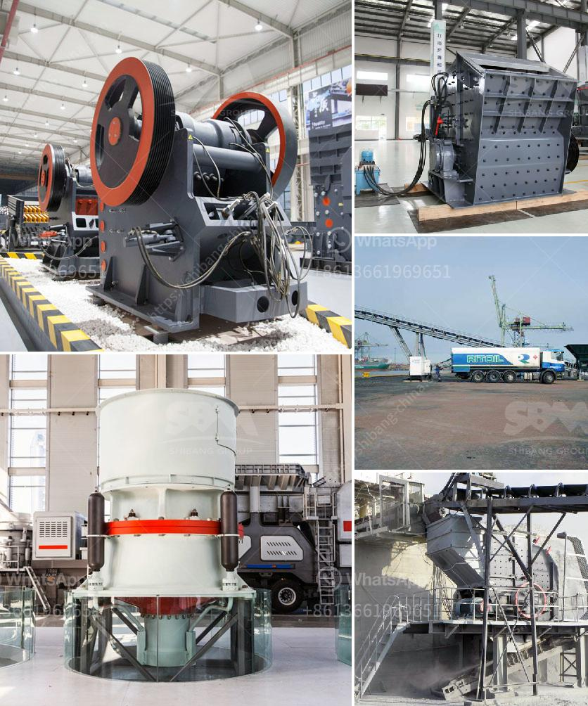

<h3>used mobile stone crushers for sale</h3>
Mobile stone crushers are a convenient and efficient option for rock crushing in remote areas. This article explains how these crushers work, the benefits they offer, and the potential for their use in the construction industry.

Rock crushers are machines used to break down rocks into smaller pieces. They are commonly used in the mining and construction industries for crushing materials such as limestone, granite, and concrete. These crushers can be mobile, meaning they can be moved to different locations, or stationary, remaining in one place.

Used mobile stone crushers for sale offer a great investment opportunity to businesses that operate in remote areas. These crushers are designed to crush rocks and stones into more manageable sizes, making them useful for construction projects. They can also be used for recycling purposes, turning demolished materials into valuable resources.

One of the primary benefits of using mobile stone crushers is their flexibility. These crushers can be transported easily from one site to another, making them ideal for construction projects in remote or hard-to-reach areas. Additionally, their compact size allows them to be used in tighter spaces, like urban environments or indoor construction sites.

Another advantage of mobile stone crushers is their cost-effectiveness. Compared to traditional rock crushers, mobile options require fewer resources and have lower maintenance costs. This can lead to significant savings for businesses, especially those operating on a tight budget. Furthermore, purchasing used mobile stone crushers can provide even greater savings, as they are often available at a lower price compared to new equipment.

In conclusion, used mobile stone crushers for sale offer numerous benefits over traditional stationary crushers. These machines are cost-effective, flexible, and suitable for crushing rocks and stones in remote areas. Whether it’s for construction projects or recycling initiatives, mobile stone crushers provide a reliable solution for any crushing needs.
<h3>Contact us</h3><ul><li><strong>Whatsapp:&nbsp;<a href="https://wa.me/8613661969651">+8613661969651</a></strong></li><li><a href="https://swt.shibang-china.com/?git&amp;zhl&amp;used mobile stone crushers for sale"><strong>Online Service(chat now)</strong></a></li></ul><h3>Related</h3><ul><li><a href='suoer fine mill grinder.md'>suoer fine mill grinder</a></li><li><a href='calculation of torque of hammer mill.md'>calculation of torque of hammer mill</a></li><li><a href='how to setup the manganese ore processing plant.md'>how to setup the manganese ore processing plant</a></li><li><a href='south africa suppliers of chrome ore beneficiation plant.md'>south africa suppliers of chrome ore beneficiation plant</a></li><li><a href='coal mining machine undercuter.md'>coal mining machine undercuter</a></li></ul>