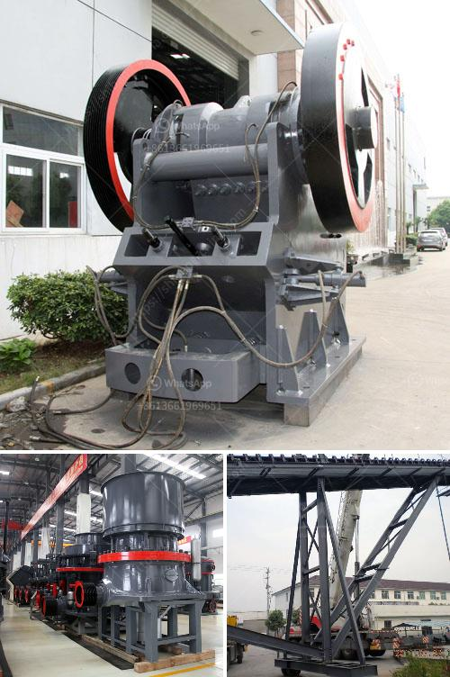

<h3>used pioneer jaw crusher</h3>
In the world of mining, finding high-quality equipment that can be relied upon for years to come is essential. And with the Pioneer Jaw Crusher, it is now easier than ever to utilize a reliable and durable machine, in order to produce results that meet the highest standards.

Manufactured by Pioneer, a trusted name in mining equipment, the Pioneer Jaw Crusher has stood the test of time when it comes to dependable primary crushing. Powered by a highly efficient, fuel-efficient diesel engine, the Pioneer Jaw Crusher offers a compact and efficient design that ensures low operating costs and easy maintenance.

With its rugged design, the Pioneer Jaw Crusher can effectively handle a wide array of hard rock materials. From limestone to basalt, and from granite to concrete rubble, the machine's robust construction ensures high durability. Furthermore, with its ability to crush materials of various sizes, the Pioneer Jaw Crusher is particularly well-suited to be used as a primary crusher in various mining applications.

The Pioneer Jaw Crusher features a high capacity range compared to its competitors. The 48-inch by 36-inch capacity jaw ensures optimal crushing capacity and throughput. With its heavy-duty design, this robust machine can withstand even the toughest quarrying conditions.

Wearing parts are easily replaceable, keeping maintenance time to a minimum. Additionally, the Pioneer Jaw Crusher utilizes an advanced grease lubrication system, ensuring continuous and efficient lubrication to all the bearings. This system is not only time-saving but also extends the lifespan of the machine.

The Pioneer Jaw Crusher's innovative design combines efficiency with low operational costs, making it a perfect choice for primary crushing applications. The unit is designed with easy-to-operate electrical controls, adjustable overhead eccentric shafts, and a resistance screen, making it extremely reliable and ensuring quick and efficient start-ups. The hydraulically adjustable wedge system allows quicker adjustments, providing greater flexibility in various crushing scenarios.

Investing in a used Pioneer Jaw Crusher will give you the peace of mind that comes with buying new, cost-effective equipment. With less initial investment required compared to new units, purchasing a used Pioneer Jaw Crusher from a reputable supplier allows you to access the same dependable performance at a lower price point.

As the backbone of many mining and quarrying operations, the Pioneer Jaw Crusher is a reliable investment that can deliver superior results. As your needs evolve over time, this durable machine can be adjusted to meet your changing requirements, ensuring optimal production levels for years to come. So, whether you are revamping an existing operation or setting up a new quarry, the Pioneer Jaw Crusher is a versatile and efficient choice that will contribute to your success.
<h3>Contact us</h3><ul><li><strong>Whatsapp:&nbsp;<a href="https://wa.me/8613661969651">+8613661969651</a></strong></li><li><a href="https://swt.shibang-china.com/?git&amp;zhl&amp;used pioneer jaw crusher"><strong>Online Service(chat now)</strong></a></li></ul><h3>Related</h3><ul><li><a href='mining process of dolomite ryamond mill in kenya.md'>mining process of dolomite ryamond mill in kenya</a></li><li><a href='slag processing machine in australia.md'>slag processing machine in australia</a></li><li><a href='stone crushing plants in kenya.md'>stone crushing plants in kenya</a></li><li><a href='conveyor belts in merida.md'>conveyor belts in merida</a></li><li><a href='lime grinding machine manufacturer in kolhapur.md'>lime grinding machine manufacturer in kolhapur</a></li></ul>