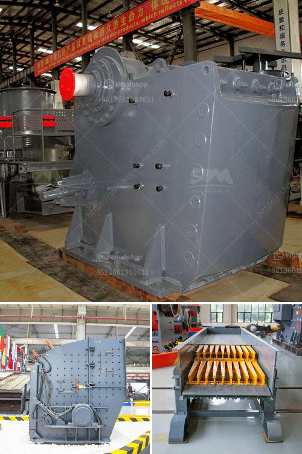

<h3>used small hand portable rock crusher</h3>
Many times, people can't find the perfect rock crusher for sale in stores or online. However, they''re often surprised by the variety of small, hand portable rock crushers available on the market. This article will discuss the benefits of owning one and give some insight into what to look for when purchasing a used model.

A small, hand portable rock crusher is perfect for those who prefer to be closer to the material they're crushing. In addition to this, it is also ideal for hard-to-reach locations or complex environments. Whether you're working in a rural area or need to crush rocks on uneven terrain, a hand portable rock crusher can make the process much more manageable.

One of the primary benefits of a small hand portable rock crusher is its portability. Unlike larger crushers that can take up a significant amount of space and require a lot of effort to transport, a small hand portable rock crusher can easily fit into the trunk of a car or backpack.

Another advantage is its ease of operation. Most small hand portable rock crushers are simple to use, with a few basic buttons or switches. This makes them especially suitable for beginners or those who may not have extensive knowledge in crushing rocks. The simplicity of these machines allows users to focus on the task at hand without unnecessary distractions.

When looking to buy a used small hand portable rock crusher, there are a few things to consider. First and foremost, check the condition of the machine. Inspect the frame, engine, belts, and any other critical components. Look for signs of wear and tear, as well as any potential damage that may affect its performance.

It's also essential to ensure that all parts are functioning correctly. Test the mechanisms thoroughly to make sure they're working as expected. Pay close attention to the crushing mechanism, as it plays a vital role in the machine's overall performance.

Lastly, consider the price. Used small hand portable rock crushers typically range in price depending on their age, condition, and brand. It's important to do your research and compare prices across different sellers to ensure you're getting a fair deal. Keep in mind that a higher price doesn't always equate to better quality, so be sure to weigh the value against the cost.

In conclusion, owning a used small hand portable rock crusher can be highly beneficial, especially for those who want a portable and easy-to-use solution for crushing rocks. It offers convenience, portability, and simplicity, making it an excellent choice for various applications. However, it's crucial to carefully inspect the machine and ensure that all parts are in good working condition before making a purchase. By doing so, you can enjoy the benefits of a small hand portable rock crusher while avoiding any potential issues or disappointments.
<h3>Contact us</h3><ul><li><strong>Whatsapp:&nbsp;<a href="https://wa.me/8613661969651">+8613661969651</a></strong></li><li><a href="https://swt.shibang-china.com/?git&amp;zhl&amp;used small hand portable rock crusher"><strong>Online Service(chat now)</strong></a></li></ul><h3>Related</h3><ul><li><a href='limestone crisher machine for sale in cebu.md'>limestone crisher machine for sale in cebu</a></li><li><a href='gold mining equipment companies in china.md'>gold mining equipment companies in china</a></li><li><a href='ball milling machine in south africa.md'>ball milling machine in south africa</a></li><li><a href='low cost jaw crusher price in uganda.md'>low cost jaw crusher price in uganda</a></li><li><a href='used stone crusher in uganda.md'>used stone crusher in uganda</a></li></ul>