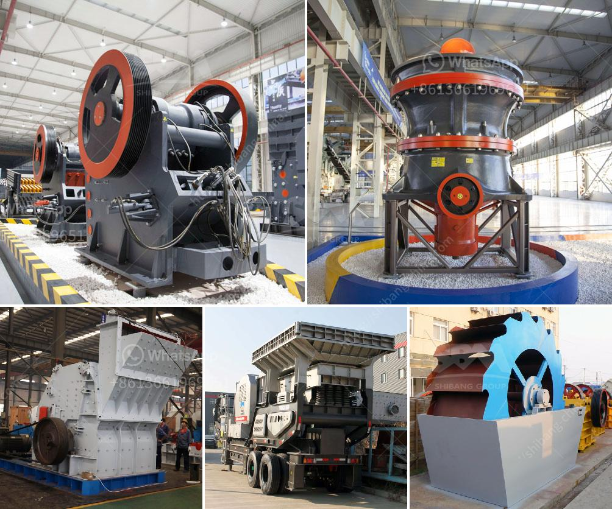

<h3>used stone crusher in germany</h3>
The concept of crusher developed in the United States in the 19th century and was popularized in Germany in the 1950s. With the increase in the number of German mining companies, the innovations in mining and crushing technology have greatly improved, enabling German manufacturers of used stone crushers to achieve high sales. Today, Germany is Europe's largest producer of aggregates and the biggest consumer of finished materials.

In the mining industry, the crushing stage is an important step. To choose a suitable crusher, a variety of factors need to be considered, such as ore properties, final product requirements, investment capacity, etc. The selected crusher must be suitable for crushing materials with a certain compressive strength, moisture content, and particle size distribution.

Used stone crusher in Germany has a long history and experienced development. With the application and development of stone crusher in mining industry, the used stone crusher has also introduced new features and performances. According to the market demand and ongoing research and development, the manufacturer has introduced a series of advanced stone crushers, such as jaw crusher, impact crusher, cone crusher, mobile crusher, VSI crusher etc.

The jaw crusher is used for primary crushers and secondary crushers for crushing all kinds of minerals and rocks with compressive strength less than 320 mpa. It is widely used in mine, metallurgy, construction, highway, railway, water conservation, chemical industry and other industries. The impact crusher is widely used in building material, chemical, coal mine and coke industry for coarse, intermediate and fine crushing of the brittle materials with less than intermediate hardness such as limestone, dolomite, shale, sandstone, coal, asbestos, graphite and rock salt etc.

In addition, the German original rotor centrifugal crusher has been widely used in various fields at home and abroad. It is an ideal crushing equipment for crushing and shaping in industrial field. In recent years, the German rotor centrifugal crusher has been well received by users and has become one of the most used stone crushers in the sand making industry.

The stone crusher in Germany adopts a fully automated design, improving the efficiency of production, and reducing the labor intensity of workers. It not only integrates the traditional crushing production line operation and maintenance management, but also adds digital control system, effectively saving labor costs, and achieving high efficiency and energy saving in the crushing production line.

Germany's used stone crusher industry has been booming, with a long history and good reputation. Quality is excellent and diverse, bringing more development opportunities to the majority of manufacturing companies. With the continuous development of industry and the continuous innovation of technology, the industry will continue to move forward and contribute to the economic development of Germany.
<h3>Contact us</h3><ul><li><strong>Whatsapp:&nbsp;<a href="https://wa.me/8613661969651">+8613661969651</a></strong></li><li><a href="https://swt.shibang-china.com/?git&amp;zhl&amp;used stone crusher in germany"><strong>Online Service(chat now)</strong></a></li></ul><h3>Related</h3><ul><li><a href='price of mobile crusher in the philippines.md'>price of mobile crusher in the philippines</a></li><li><a href='gypsum production line.md'>gypsum production line</a></li><li><a href='impact crusher for sale in bulawayo.md'>impact crusher for sale in bulawayo</a></li><li><a href='clay crushers for clay crushing process.md'>clay crushers for clay crushing process</a></li><li><a href='talc grinding mills usa.md'>talc grinding mills usa</a></li></ul>