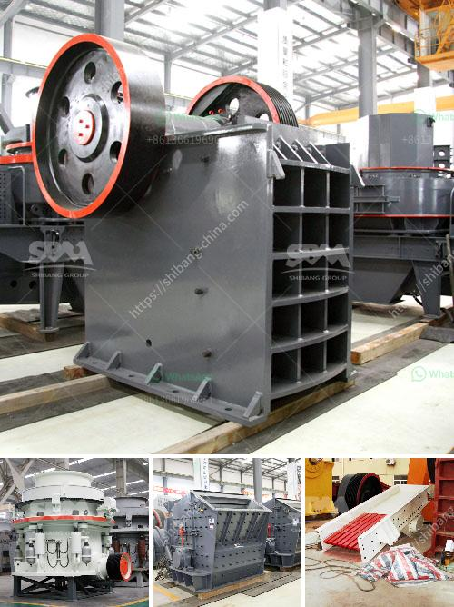

<h3>used stone crusher in uganda</h3>
The stone crusher machine works by using high pressure to break stones into smaller sizes. This machine is widely used in processing stones in mining or in infrastructure development projects. The stone-crusher machine relies on dodge and blake to destroy the rock. Jaw crusher is one of the most popular stone crushing machines used in the world. Jaw Crusher is an ideal stone crusher machine and can destroy stones well.

Jaw Crusher has a very high pressure so it can destroy very hard stones. Jaw Crusher has many advantages so it is widely used in the construction and mining process. Here are some of the advantages of jaw crusher stone crusher machine.

1. Jaw Crusher is a stone machine with a simple structure so that the maintenance and maintenance process is easier and cheaper.

2. Jaw Crusher has a flexible capacity, making it easier to break rocks. We can adjust the capacity to the process to be carried out.

3. Jaw Crusher has protection from over load so as to ensure the safety and condition of all rocks processed.

4. The use of stone crusher machine will provide high efficiency for the users plus operating costs that can be minimized in such a way.

5. The final result of particles and the ratio of crushed later is very qualified and in accordance with the desired size.

6. Jaw Crusher machine is made of hardened steel (high carbon steel). It puts the moveable jaw stock in motion (through the motor, pulley and belt arrangement) that produces the needed force to crush materials.

7. Jaw Crusher is used in many ways and plays a key role in mining, smelting, building materials, roads, railways, water conservancy, and chemical industries.

8. Jaw Crusher teeth are easy to wear due to constant contact with materials. The operator needs to pay attention to them in order to avoid abrasion and fracture.

Therefore, when choosing a stone crusher machine, it is important to consider the various features such as the hardness of the processed stones, the desired output size, and the capacity requirements of the desired product. In general, crushing stones can be carried out with a stone crusher machine and working with a combination of jaw crushers, impact crushers, and cone crushers. The stone crusher machine has features such as simple structure, reliable functioning, easy operation, convenient maintenance, low production cost, and etc. to sum up, the stone crusher machine has added better efficiency, high productivity, and low consumption in high-pressure material handling process in mining operations in Uganda.

The stone crusher machine relies on dodge and blake to destroy the rock. Jaw crusher is one of the most popular stone crushing machines used in the world. Jaw Crusher is an ideal stone crusher machine and can destroy stones well.
<h3>Contact us</h3><ul><li><strong>Whatsapp:&nbsp;<a href="https://wa.me/8613661969651">+8613661969651</a></strong></li><li><a href="https://swt.shibang-china.com/?git&amp;zhl&amp;used stone crusher in uganda"><strong>Online Service(chat now)</strong></a></li></ul><h3>Related</h3><ul><li><a href='ball mill manufacturers in korea.md'>ball mill manufacturers in korea</a></li><li><a href='marble quarry mining crusher in sudan.md'>marble quarry mining crusher in sudan</a></li><li><a href='small scall stone crushing machine.md'>small scall stone crushing machine</a></li><li><a href='clinker grinding mill machine germany.md'>clinker grinding mill machine germany</a></li><li><a href='manufacturing cost of 6mm rolling mill.md'>manufacturing cost of 6mm rolling mill</a></li></ul>