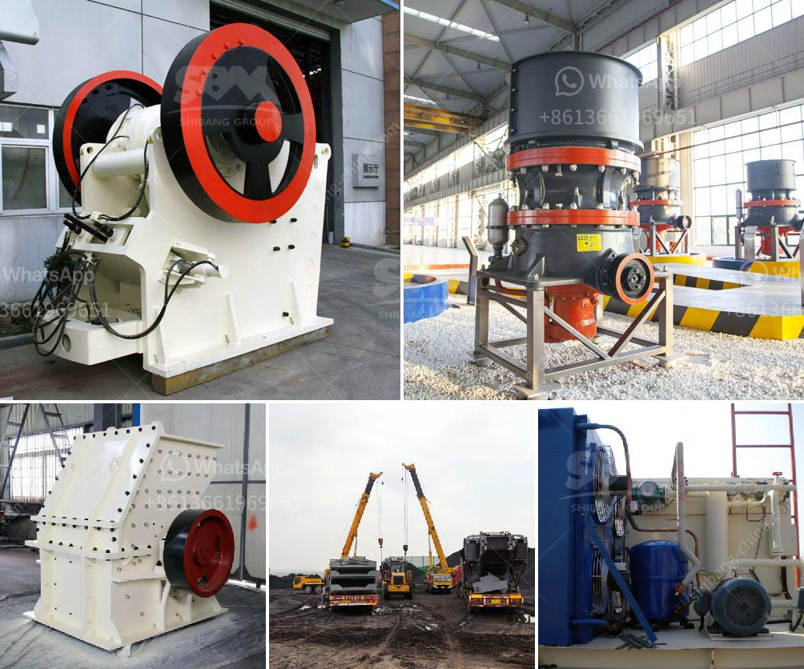

<h3>used stone crushers for sale from uae</h3>
Used stone crushers for sale from UAE is the ideal equipment for quarrying, construction waste recycling, and mining applications. We offer mobile and stationary stone crushers for sale in UAE. The available crushers are Jaw crushers, impact crusher, cone crushers, and portable crusher. These crushers are manufactured with high performance and durability in mind, ensuring reliable operation for years to come.

When it comes to crushing materials, the crushers are designed to handle a wide range of different types of materials such as limestone, granite, basalt, and more. They are also ideal for crushing construction waste, allowing you to recycle materials for reuse in future projects.

One of the main advantages of buying used stone crushers for sale from UAE is the cost savings. Compared to brand new crushers, used ones are more affordable. You can save a significant amount of money by buying a quality used crusher rather than investing in a brand new one. This is especially beneficial for small businesses or startups on a limited budget.

Another advantage of buying used stone crushers is the availability of a wide range of options. With a used crusher, you have the flexibility to choose the right size and type of crusher that suits your specific needs. Whether you need a primary crusher for large-scale mining operations or a smaller secondary crusher for a construction project, there is a used crusher available that will meet your requirements.

Buying used stone crushers for sale from UAE means you can take advantage of various finance options. For example, some sellers may offer financial solutions to help you complete the purchase. This makes it easier for businesses to acquire the necessary equipment and get their operations up and running.

In conclusion, used stone crushers for sale from UAE offer a cost-effective and reliable solution for crushing tasks. They are highly versatile and ideal for quarrying, mining, and recycling applications. By choosing a used crusher, you can save money and benefit from a wide selection of options. With various financial solutions available, it's easier than ever to get the equipment you need.
<h3>Contact us</h3><ul><li><strong>Whatsapp:&nbsp;<a href="https://wa.me/8613661969651">+8613661969651</a></strong></li><li><a href="https://swt.shibang-china.com/?git&amp;zhl&amp;used stone crushers for sale from uae"><strong>Online Service(chat now)</strong></a></li></ul><h3>Related</h3><ul><li><a href='stone crusher plant in ghana.md'>stone crusher plant in ghana</a></li><li><a href='ball mill diagram manufacturers in bangalore.md'>ball mill diagram manufacturers in bangalore</a></li><li><a href='rock quarry equipment for sale.md'>rock quarry equipment for sale</a></li><li><a href='stone quarries cursher south africa.md'>stone quarries cursher south africa</a></li><li><a href='different part of barite and bentonite mill.md'>different part of barite and bentonite mill</a></li></ul>