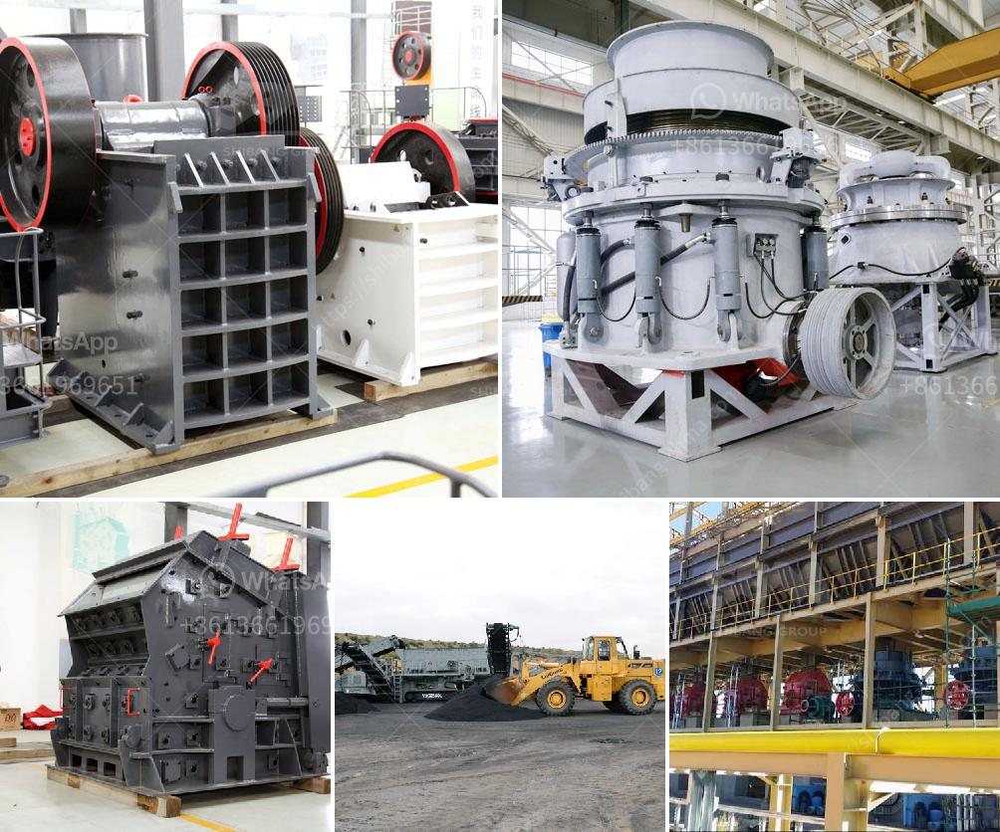

<h3>used stone crushers for sale kenya</h3>
Used stone crushers for sale Kenya is an ideal option to save money on construction projects. With the booming infrastructure development in Kenya, there is a huge demand for used stone crushers on sale. One of the most widely used stone crushers in Kenya is the jaw crusher. It is widely used in crushing various materials like limestone, granite, basalt, river rock, bauxite, etc. With the compact structure and stable performance, the jaw crusher has been widely used in Kenya to process raw materials for the construction industry.

The stone crusher machine for sale in Kenya is versatile and powerful. With a wide range of crushing capabilities, it can be used to process limestone, granite, basalt, river rock, bauxite, etc. And with the compact structure and stable performance, the machine can efficiently process different materials. The working principle of the stone crusher is straightforward. It uses the force of the moving jaw to crush the material against the stationary jaw. As the material is crushed, it falls down through the discharge opening.

There are different types of used stone crushers for sale in Kenya, including one-stage jaw crushers, two-stage jaw crushers, and multi-stage impact crushers. These machines have different crushing abilities, providing different outputs. Depending on the requirements of the construction project, you can choose the most suitable stone crusher for your needs. Additionally, the availability of used stone crushers for sale in Kenya makes it easy to find the right equipment for your project at a cost-effective price.

In conclusion, used stone crushers for sale Kenya represent a great investment opportunity. Whether you are an individual looking for a machine for a small construction project or a contractor looking to add to your fleet, there is a wide range of stone crushers available in the Kenyan market. The versatile and powerful machines can efficiently process various materials, providing the output you need for your project. With the availability of used stone crushers, you can save money while getting high-quality equipment to complete your construction projects efficiently.
<h3>Contact us</h3><ul><li><strong>Whatsapp:&nbsp;<a href="https://wa.me/8613661969651">+8613661969651</a></strong></li><li><a href="https://swt.shibang-china.com/?git&amp;zhl&amp;used stone crushers for sale kenya"><strong>Online Service(chat now)</strong></a></li></ul><h3>Related</h3><ul><li><a href='aggregate crushing processes.md'>aggregate crushing processes</a></li><li><a href='quotation for crushing and screening.md'>quotation for crushing and screening</a></li><li><a href='double rollar mill.md'>double rollar mill</a></li><li><a href='allis chalmers gyratory crushers.md'>allis chalmers gyratory crushers</a></li><li><a href='advance stone agregate crusher equipments.md'>advance stone agregate crusher equipments</a></li></ul>