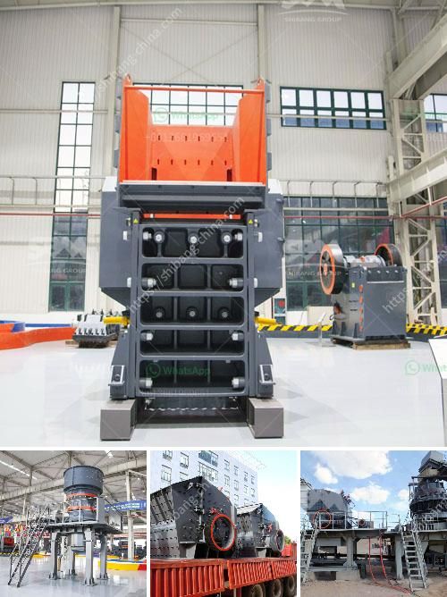

<h3>used stone cursher machinery in uae</h3>
The United Arab Emirates (UAE) has vast reserves of stone materials that are efficient for various construction purposes. Stone crushers are an important part of the UAE's construction industry. However, crushing operations involve a lot of energy and generate large quantities of dust that reduce the quality of the final product. These crushers are a cost-effective solution that provides the necessary horsepower and crushing power for demanding applications.

Stone crusher machines are available in different models with a range of capacities. Depending on the scale of your project, you can choose the suitable stone crusher machines for your application. Stone crushing machines are efficient and come with inbuilt technology that enables them to crush more stones within less time. These machines are also equipped with anti-wear protection, ensuring that the machinery resists abrasion from the stones being crushed.

When it comes to buying used stone crusher machinery in UAE, there are many options to consider. The first and most crucial decision is to choose the reputed and reliable supplier who can provide you with the best quality machinery at an affordable price. This is important to ensure that you get a reliable and durable machine that can withstand the demanding conditions of the UAE's construction industry.

One of the popular options for buying used stone crusher machinery in UAE is to approach used stone crusher machinery suppliers. These suppliers offer used stone crushers that are in working condition and are backed by their experience and expertise. The major advantage of buying used stone crusher machinery from these suppliers is that they evaluate the condition of the machine and perform necessary repairs before listing the equipment for sale in the market.

The used stone crusher machinery vendors in UAE also provide comprehensive support for maintenance and servicing of the equipment. They have a team of experienced technicians who can inspect, repair, and maintain the machinery to ensure its optimum performance. This support ensures that your investment in used stone crusher machinery is well-maintained and provides reliable service over the long term.

Buying used stone crusher machinery in UAE can significantly reduce your capital expenditure. It allows you to acquire high-quality machinery at a fraction of the cost compared to buying new equipment. Moreover, purchasing used machinery helps to reduce the carbon footprint associated with manufacturing new machinery while also minimizing waste.

In conclusion, used stone crusher machinery in UAE is a cost-effective option for construction companies and other industries that require stone crushing machinery. It provides the necessary power and crushing capabilities to break down stone materials efficiently. By approaching reputable suppliers, you can ensure that you acquire reliable and well-maintained machinery that meets your project requirements. With proper maintenance and servicing, used stone crusher machinery can serve your needs for years to come, helping you achieve your construction goals while minimizing costs.
<h3>Contact us</h3><ul><li><strong>Whatsapp:&nbsp;<a href="https://wa.me/8613661969651">+8613661969651</a></strong></li><li><a href="https://swt.shibang-china.com/?git&amp;zhl&amp;used stone cursher machinery in uae"><strong>Online Service(chat now)</strong></a></li></ul><h3>Related</h3><ul><li><a href='hammer crusher in china.md'>hammer crusher in china</a></li><li><a href='brand new stone crusher for sale in the philippines.md'>brand new stone crusher for sale in the philippines</a></li><li><a href='copper crusher exporter in south africa.md'>copper crusher exporter in south africa</a></li><li><a href='mill balls for mill in bolivia.md'>mill balls for mill in bolivia</a></li><li><a href='safety of conveyor belt ppt.md'>safety of conveyor belt ppt</a></li></ul>