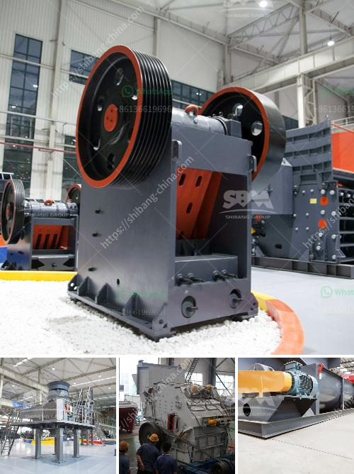

<h3>used washing plant sale south africa</h3>
South Africa, an emerging economy with a population of over 58 million, faces severe water scarcity and quality issues. The country is characterized by irregular rainfall patterns and droughts, which worsen the water supply situation. In such circumstances, sustainable water management becomes a paramount concern for industries, households, and governmental bodies.

One practical solution that has gained momentum in recent years is the sale of used washing plants. These plants have been previously employed in various industries, such as mining, construction, and municipal waste management. By repurposing these facilities, South Africa has found an innovative way to optimize water usage and reduce the overall environmental footprint.

Used washing plants are designed to treat large volumes of water contaminated with sediments, chemicals, and other pollutants. These facilities employ specialized equipment and techniques to remove impurities and polish the water to an acceptable quality standard. As a result, these plants can serve as valuable assets in water-scarce regions like South Africa, addressing both quality and quantity concerns.

The sale of used washing plants in South Africa provides numerous benefits. Firstly, it offers a cost-effective solution for water treatment. By purchasing second-hand equipment, industries and municipalities can avoid excessive capital expenditure and instead invest in more critical areas of development.

Secondly, the reuse of these plants aligns with the principle of resource conservation. Instead of building new facilities from scratch, which requires significant resources and energy, repurposing used washing plants avoids additional strain on the environment. In a country like South Africa, where natural resources are already under pressure, this approach contributes to a more sustainable future.

Furthermore, the integration of used washing plants into existing infrastructure is relatively straightforward. These adaptable facilities can be modified to suit various water treatment needs, whether it be industrial effluent, mine wastewater, or municipal sewage. This versatility allows for more efficient planning, avoiding the need for multiple specific-purpose plants.

Moreover, the sale of used washing plants promotes circular economy principles. Rather than disposing of outdated equipment into landfills or scrapyards, they are given a new lease of life. This reduces waste generation and contributes to a closed-loop system, where resources are continually utilized and the environmental impact minimized.

However, there are challenges associated with the sale of used washing plants. Ensuring the efficiency and reliability of the equipment is crucial, as any malfunction or breakdown could have severe consequences for water treatment processes. Therefore, it is essential for buyers to thoroughly inspect and assess the condition of the plants before making a purchase.

Additionally, effective maintenance plans and training programs are necessary to ensure the long-term operation of these plants. Providing the required technical expertise and support to operators is vital for their successful integration and sustained functionality.

In conclusion, the sale of used washing plants in South Africa is an innovative solution for addressing water scarcity and quality concerns. Offering cost-effective and sustainable options, these repurposed facilities optimize water management, reduce environmental impact, and promote resource conservation. However, careful inspection, maintenance, and operator training are essential to maximize the benefits of these plants and ensure their efficient operation in the long run. With continued commitment to water stewardship, South Africa can pave the way for a more water-resilient future.
<h3>Contact us</h3><ul><li><strong>Whatsapp:&nbsp;<a href="https://wa.me/8613661969651">+8613661969651</a></strong></li><li><a href="https://swt.shibang-china.com/?git&amp;zhl&amp;used washing plant sale south africa"><strong>Online Service(chat now)</strong></a></li></ul><h3>Related</h3><ul><li><a href='gold mining equipment companies in china.md'>gold mining equipment companies in china</a></li><li><a href='gypsum board connection machine.md'>gypsum board connection machine</a></li><li><a href='stone crusher factory.md'>stone crusher factory</a></li><li><a href='jaw crusher construction.md'>jaw crusher construction</a></li><li><a href='portable hard rock mining.md'>portable hard rock mining</a></li></ul>