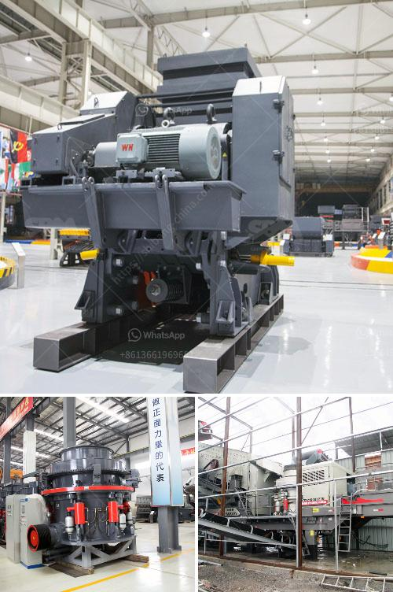

<h3>uses of stone crusher equipment pdf</h3>
The stone crusher equipment is necessary for the mining machinery and equipment, jaw crusher is widely used for crushing ore, building stone, rock, metal, ore, solid waste, stone crusher equipment, road construction, construction industry and other fields. It is especially suitable for crushing multiple materials with compressive strength less than 320 MPa.

In recent years, with the rapid development of the construction industry, the demand for stone aggregate is also increasing, which has promoted the development of the stone crusher equipment industry. The stone crusher equipment can process materials from 100-300mm into finer particles in a variety of fields, which has stable performance and high production efficiency. It is widely used in the mining, metallurgy, chemical, building materials, electric power, water conservancy, transportation and other industries.

The main advantages of the stone crusher equipment are large crushing ratio, high crushing efficiency, easy maintenance, and low operating cost. It is an ideal choice for medium and fine crushing. In addition, the stone crusher equipment is also used for the production of sand and gravel materials in the construction industry. The processed materials can be sold directly to the market or used for paving the road, playing a significant role in the development of infrastructure construction.

Furthermore, the stone crusher equipment is also used for the crushing of various materials with different hardness levels. It can crush materials with a Mohs hardness of up to 9.3 and a compressive strength of up to 320 MPa. Whether it is limestone, granite, basalt, diabase, andesite, ore tailings, construction waste, quartz stone, cement clinker, etc., it can be used to crush them efficiently.

In conclusion, the stone crusher equipment is versatile, efficient, and highly cost-effective. It plays a crucial role in the construction industry and mining industry. With its wide range of applications and high crushing capacity, it has become an essential tool for many companies and projects. As technology advances, the stone crusher equipment is constantly innovating and improving, providing more efficient and reliable equipment options for the market.
<h3>Contact us</h3><ul><li><strong>Whatsapp:&nbsp;<a href="https://wa.me/8613661969651">+8613661969651</a></strong></li><li><a href="https://swt.shibang-china.com/?git&amp;zhl&amp;uses of stone crusher equipment pdf"><strong>Online Service(chat now)</strong></a></li></ul><h3>Related</h3><ul><li><a href='pakistan quarry crusher manufacturer.md'>pakistan quarry crusher manufacturer</a></li><li><a href='mobile crushing unit.md'>mobile crushing unit</a></li><li><a href='gold ore milling machine.md'>gold ore milling machine</a></li><li><a href='for sale used mobile jaw crusher philippines.md'>for sale used mobile jaw crusher philippines</a></li><li><a href='2nd hand old mining process plant.md'>2nd hand old mining process plant</a></li></ul>