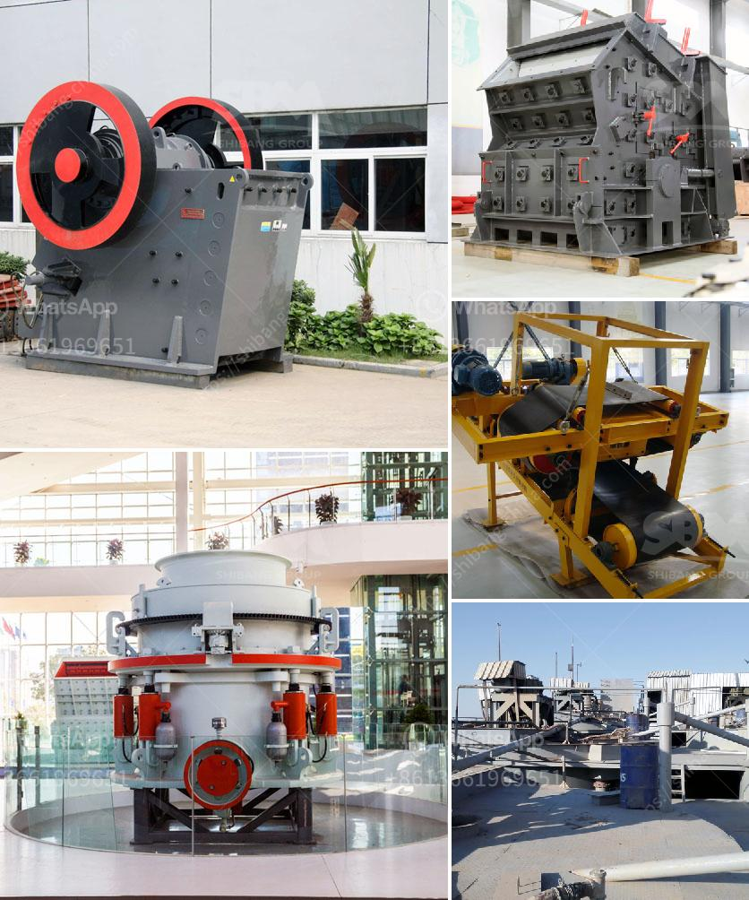

<h3>vertical coal mill manufacturer in china</h3>
Vertical coal mill, also known as coal mill, roller mill or cement vertical roller mill, is a specialized piece of equipment obtained through scientific research and grinding of various coal products. The vertical mill combines crushing, grinding, drying and powder selection into one unit, making it a high-yield and low-consumption coal grinding equipment. With its outstanding advantages, it has been widely used in the thermal power plant desulfurization project and other fields in China.

As the core equipment in the production of pulverized coal, vertical coal mill plays a vital role in the efficient operation of the power plant. The coal pulverizing system in the extraction of energy from coal consists of three main parts: coal receiving, transportation, and burning. The purpose of the vertical coal mill is to pulverize coal particles and provide fuel to the boiler. So, it is essential to select a suitable vertical coal mill manufacturer for ensuring the stable operation of the power plant.

In China, there are numerous manufacturers of vertical coal mills, many of which have a strong research and development team and advanced manufacturing capabilities. Among them, one of the leading vertical coal mill manufacturers is Henan Hongxing Mining Machinery Co., Ltd. Since its establishment in 1980, Hongxing has been committed to providing customers with high-quality grinding equipment and comprehensive technical support.

Henan Hongxing Mining Machinery Co., Ltd. has its own unique advantages in the production of vertical coal mills. First and foremost, the company has a highly skilled and experienced team of engineers who are capable of designing and manufacturing vertical coal mills with different specifications to meet the diverse needs of customers. With continuous innovation and improvement, Hongxing has successfully developed the HRM series of vertical coal mills, which have stable performance, high grinding efficiency, and low energy consumption.

Furthermore, Hongxing has established a complete quality control system to ensure the reliability and durability of its vertical coal mills. The company strictly controls the quality of raw materials, adopts advanced production technologies, conducts rigorous product inspections, and carries out comprehensive performance tests to guarantee that each machine delivered to the customers is of the highest quality.

Apart from excellent product quality, Henan Hongxing Mining Machinery Co., Ltd. also provides comprehensive after-sales services to its customers. The company offers installation guidance, technical training, and regular maintenance services, aiming to help customers operate the vertical coal mill smoothly and efficiently. Moreover, Hongxing has a strong logistics system that can ensure timely delivery of the products to different regions in China.

In conclusion, choosing a reliable vertical coal mill manufacturer is of great importance for the stable and efficient operation of a coal-fired power plant. Henan Hongxing Mining Machinery Co., Ltd., with its rich experience, advanced technology, and excellent after-sales services, is undoubtedly a trustworthy partner for customers in need of vertical coal mills in China.
<h3>Contact us</h3><ul><li><strong>Whatsapp:&nbsp;<a href="https://wa.me/8613661969651">+8613661969651</a></strong></li><li><a href="https://swt.shibang-china.com/?git&amp;zhl&amp;vertical coal mill manufacturer in china"><strong>Online Service(chat now)</strong></a></li></ul><h3>Related</h3><ul><li><a href='clinker plant cost.md'>clinker plant cost</a></li><li><a href='used small hand portable rock crusher.md'>used small hand portable rock crusher</a></li><li><a href='stone crusher sand block maker.md'>stone crusher sand block maker</a></li><li><a href='fairly used quarry crusher in nigeria price.md'>fairly used quarry crusher in nigeria price</a></li><li><a href='gypsum manufacturing plant from turkey.md'>gypsum manufacturing plant from turkey</a></li></ul>