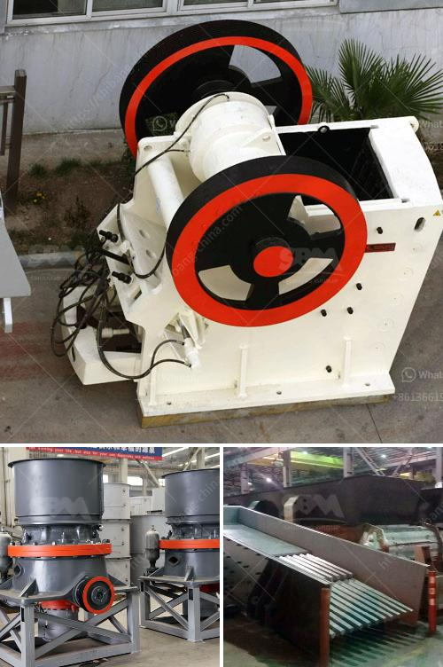

<h3>vertical grinder mill</h3>
A vertical grinder mill is an efficient machine that grinds materials into powder form, which is used in various industries. This type of mill is designed to grind multiple types of materials, such as limestone, gypsum, coal, and minerals. It is commonly used in the cement industry, power plants, and chemical industry.

The vertical grinder mill operates by rotating the grinding table, which is equipped with grinding rollers. The material is fed into the mill through a central inlet pipe and falls onto the grinding table. As the table rotates, the material is ground between the rollers and the grinding table.

One of the key advantages of a vertical grinder mill is its ability to handle high moisture and sticky materials. With the help of a hot gas generator, the mill can dry and grind materials simultaneously, preventing the blockage of the grinding chamber. This is especially useful in processing materials with high moisture content, such as limestone and coal.

Another advantage of a vertical grinder mill is its energy efficiency. Compared to traditional ball mills, a vertical mill consumes less energy. This is because the grinding principle of the vertical mill is more efficient, resulting in higher grinding efficiency and lower energy consumption.

Moreover, a vertical grinder mill offers a smaller footprint compared to other types of grinding mills. This makes it ideal for installation in compact spaces, such as existing plants or retrofit projects.

In conclusion, a vertical grinder mill is a versatile and efficient machine that grinds materials into powder form. Its ability to handle high moisture and sticky materials, energy efficiency, and compact footprint make it an ideal choice for various industries. Whether it is cement, power, or chemical industry, a vertical grinder mill proves to be a reliable and efficient solution for grinding needs.
<h3>Contact us</h3><ul><li><strong>Whatsapp:&nbsp;<a href="https://wa.me/8613661969651">+8613661969651</a></strong></li><li><a href="https://swt.shibang-china.com/?git&amp;zhl&amp;vertical grinder mill"><strong>Online Service(chat now)</strong></a></li></ul><h3>Related</h3><ul><li><a href='pe 100x60 jaw crusher for laboratory.md'>pe 100x60 jaw crusher for laboratory</a></li><li><a href='coal making process.md'>coal making process</a></li><li><a href='barite powder processing plant process.md'>barite powder processing plant process</a></li><li><a href='cedar rapids crusher for sale.md'>cedar rapids crusher for sale</a></li><li><a href='jaw crusher construction.md'>jaw crusher construction</a></li></ul>