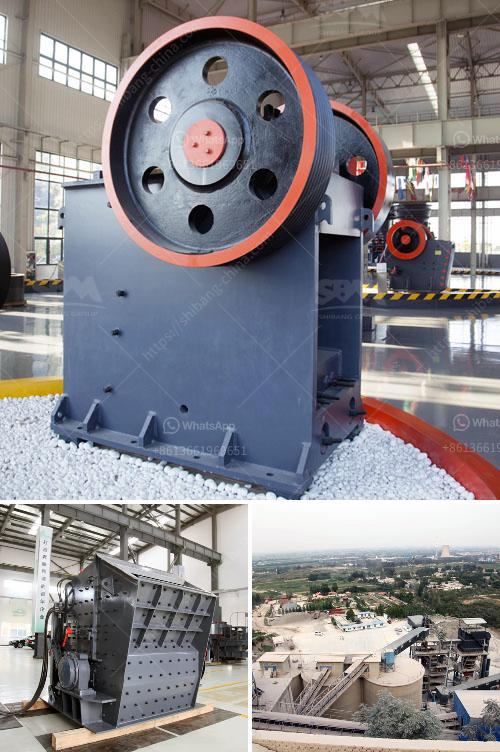

<h3>vertical mill rock</h3>
In the world of industrial machinery, efficiency and effectiveness often play vital roles in determining the success of various processes, such as grinding and milling. One innovative machine that has revolutionized these activities is the vertical mill rock. With its unique design and remarkable features, it has become the go-to solution for many industries seeking superior grinding capabilities.

A vertical mill rock, also known as a vertical roller mill, utilizes multiple rollers to crush raw materials into fine powders. Unlike traditional millstones or ball mills, this machine operates in a vertical orientation, allowing gravity to assist in the grinding process. This innovative approach ensures that all particles receive equal treatment, resulting in enhanced overall efficiency.

One of the key advantages of a vertical mill rock lies in its exceptional grinding capacity. By featuring multiple rollers, this machine can simultaneously grind, dry, and classify materials, enhancing productivity and expediting the manufacturing process. Unlike traditional mills that require separate equipment for these operations, a vertical mill rock streamlines the workflow, saving both time and resources.

Furthermore, a vertical mill rock is highly versatile, capable of handling various materials and producing multiple types of products. Whether grinding coal, cement, limestone, or other materials, this machine can provide consistent and high-quality output across different industries. Its ability to produce fine powders makes it suitable for applications in cement production, power generation, metallurgy, chemical engineering, and many others.

Not only does a vertical mill rock excel in grinding capacity and versatility, but it also delivers numerous benefits in terms of energy efficiency and environmental sustainability. Its integrated drying system eliminates the need for additional equipment, reducing energy consumption while ensuring optimal moisture levels for the grinding process. Similarly, its advanced classification system separates particles of different sizes, achieving desired fineness with precision and minimizing energy waste.

Additionally, a vertical mill rock features a compact design, occupying less space in comparison to traditional grinding machines. This benefit not only saves valuable floor space in industrial settings but also facilitates convenient installation and maintenance. Moreover, its low noise and vibration levels ensure a comfortable working environment for operators.

To further enhance usability and performance, many vertical mill rock models incorporate advanced automation and control systems. These technologies enable remote monitoring, real-time data analysis, and precise adjustments, optimizing the machine's efficiency and ensuring consistent and reliable output.

In conclusion, a vertical mill rock has emerged as a game-changer in the world of grinding and milling. Its unique design and remarkable features contribute to increased productivity, versatility, and energy efficiency. With its ability to handle various materials and produce fine powders, it has become an indispensable asset for industries across the globe. As technology continues to advance, we can expect further improvements in vertical mill rock capabilities, solidifying its position as the ultimate solution for efficient grinding.
<h3>Contact us</h3><ul><li><strong>Whatsapp:&nbsp;<a href="https://wa.me/8613661969651">+8613661969651</a></strong></li><li><a href="https://swt.shibang-china.com/?git&amp;zhl&amp;vertical mill rock"><strong>Online Service(chat now)</strong></a></li></ul><h3>Related</h3><ul><li><a href='concrete crushers for rent nigeria.md'>concrete crushers for rent nigeria</a></li><li><a href='industrial mill price industrial mill.md'>industrial mill price industrial mill</a></li><li><a href='hammer crusher in china.md'>hammer crusher in china</a></li><li><a href='clay crusher machine.md'>clay crusher machine</a></li><li><a href='micro powder grinding mill.md'>micro powder grinding mill</a></li></ul>