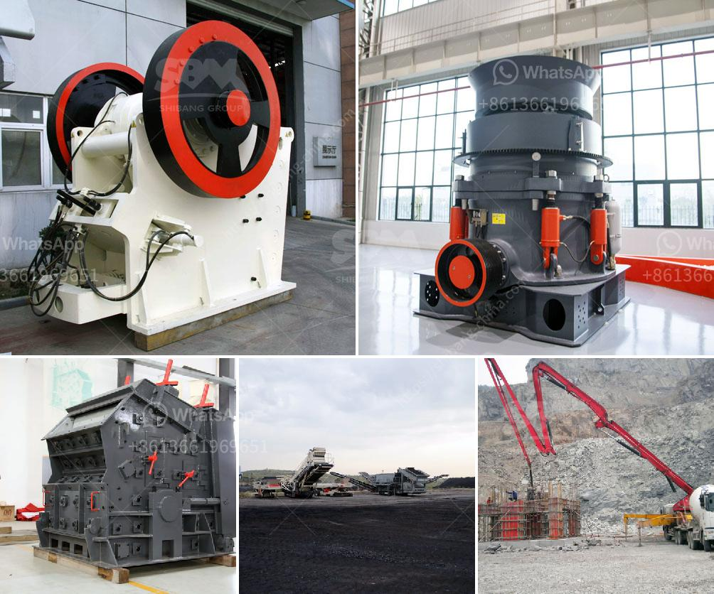

<h3>vertical mill working principle of the hydraulic</h3>
The vertical mill is a type of milling equipment widely used in cement plants and other industrial sectors. It is mainly used for grinding raw materials and cement clinker, as well as other industrial materials such as slag, coal ash, limestone, etc.

The working principle of the vertical mill is based on a hydraulic system. Firstly, the material is crushed into smaller particles by the action of the crusher. The crushed material then enters the grinding chamber of the vertical mill, where the pressure is exerted by the hydraulic system to grind the material into a fine powder.

The hydraulic system of the vertical mill consists of a hydraulic station, a hydraulic cylinder, a pull rod, an accumulator, and a pressure gauge. The hydraulic cylinder is connected to the grinding roller through the pull rod, and the accumulator stores the pressure of the hydraulic system. The pressure in the hydraulic system is controlled by the pressure gauge, which can be adjusted according to the requirements of the grinding process.

During operation, the hydraulic system provides a constant pressure to the grinding roller, which helps to maintain a stable grinding process. The pressure exerted by the hydraulic system can be adjusted to control the particle size of the ground material. This helps to achieve the desired fineness and quality of the final product.

In addition, the hydraulic system of the vertical mill also plays a role in preventing damage to the grinding roller and other components. It can automatically adjust the pressure to avoid overloading or excessive pressure on the machine.

In summary, the working principle of the vertical mill is based on a hydraulic system, which provides a constant pressure for grinding raw materials. This ensures a stable and efficient grinding process, and also helps to prevent damage to the machine. The vertical mill is an important equipment in cement plants and other industrial sectors, and its efficient operation relies on the proper functioning of the hydraulic system.
<h3>Contact us</h3><ul><li><strong>Whatsapp:&nbsp;<a href="https://wa.me/8613661969651">+8613661969651</a></strong></li><li><a href="https://swt.shibang-china.com/?git&amp;zhl&amp;vertical mill working principle of the hydraulic"><strong>Online Service(chat now)</strong></a></li></ul><h3>Related</h3><ul><li><a href='secondary rock crusher.md'>secondary rock crusher</a></li><li><a href='cost of limestone pulverizer.md'>cost of limestone pulverizer</a></li><li><a href='hammer mill rock crusher.md'>hammer mill rock crusher</a></li><li><a href='kenya sand making machine.md'>kenya sand making machine</a></li><li><a href='trommel screen capacity calculation.md'>trommel screen capacity calculation</a></li></ul>