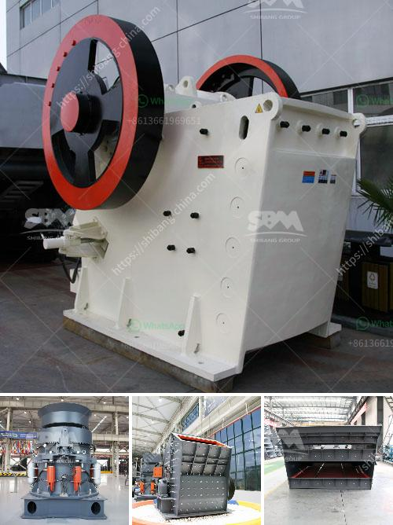

<h3>vertical roller mills manufacturer in india</h3>
Vertical roller mills belong to a significant industry in India. Due to the high demand for these mills by various industries, it requires a robust infrastructure to produce these machines at a large scale. This is where the vertical roller mills manufacturer in India comes into play. These manufacturers have extensive knowledge and expertise in designing and manufacturing high-quality vertical roller mills.

Vertical roller mills are essentially large grinding machines that crush and grind materials into smaller particles. These mills have a wide range of applications such as in mining, cement, and power generation industries. The efficient design and operation of a vertical roller mill have a significant impact on the overall performance of the plant.

One of the prominent manufacturers of vertical roller mills in India is Gebr. Pfeiffer SE. This company has gained expertise in manufacturing vertical roller mills that are widely used in the cement industry. Gebr. Pfeiffer has been in the industry for over 150 years and has built a strong reputation for providing innovative solutions and reliable technology.

Another leading manufacturer in India is Loesche India Pvt. Ltd. Loesche India has been in operation for more than 30 years and has supplied numerous vertical roller mills to various industries in India. The company focuses on delivering sustainable and energy-efficient solutions to its customers.

The vertical roller mills manufactured by these companies are designed to deliver high performance and energy efficiency. They are equipped with advanced technology that ensures smooth and efficient operation. These mills have high grinding efficiency and low power consumption, making them an ideal choice for industries looking to optimize their energy consumption.

In addition to Gebr. Pfeiffer and Loesche India, there are several other manufacturers in India that produce vertical roller mills. These manufacturers are constantly investing in research and development to improve the performance and efficiency of their mills. They also provide comprehensive after-sales support and services to ensure the smooth operation of their mills.

The vertical roller mills manufactured in India have also gained recognition globally. Due to their high performance and reliability, these mills are exported to various countries. This has further propelled the growth of the vertical roller mill industry in India.

Overall, the vertical roller mills manufacturer in India plays a significant role in meeting the growing demand for these mills. With their expertise and advanced technology, these manufacturers contribute to the development of the Indian industrial sector. The vertical roller mills they produce help industries in India achieve increased productivity, energy efficiency, and sustainability.
<h3>Contact us</h3><ul><li><strong>Whatsapp:&nbsp;<a href="https://wa.me/8613661969651">+8613661969651</a></strong></li><li><a href="https://swt.shibang-china.com/?git&amp;zhl&amp;vertical roller mills manufacturer in india"><strong>Online Service(chat now)</strong></a></li></ul><h3>Related</h3><ul><li><a href='cement machinery suppliers grinding unit.md'>cement machinery suppliers grinding unit</a></li><li><a href='silica sand mine owners in pakistan.md'>silica sand mine owners in pakistan</a></li><li><a href='used gold stamp mill for sale in south africa.md'>used gold stamp mill for sale in south africa</a></li><li><a href='grinding and sorting equipment sand gravel.md'>grinding and sorting equipment sand gravel</a></li><li><a href='how to make ganpati with marble powdee.md'>how to make ganpati with marble powdee</a></li></ul>