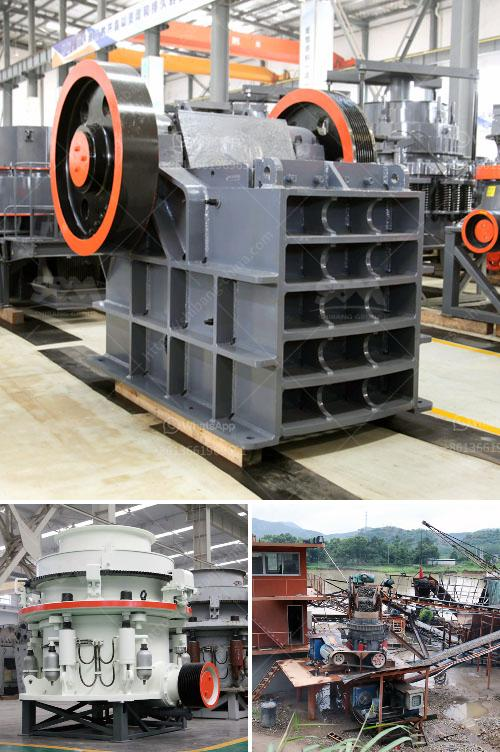

<h3>vibrating screen price philippines</h3>
The Philippines is a vibrant and booming market for vibrating screens. With a growing economy and increasing investments in infrastructure development, the demand for construction materials and equipment is on the rise. One such equipment that is in high demand is the vibrating screen.

Vibrating screens are widely used in industries such as mining, metallurgy, coal, and construction. They are essential in the process of separating materials and are capable of screening different types of particles efficiently. These screens are highly versatile and can be used for various applications, ranging from coarse sizing to fine screening.

When it comes to the price of vibrating screens in the Philippines, several factors come into play. The size of the screen, its capacity, and the materials used in its construction are some of the key factors that determine its price. Typically, vibrating screens in the Philippines range from Php 50,000 to Php 200,000. However, for larger and more high-performance screens, the price can go up to Php 500,000 or even higher.

It is essential to consider the quality and reliability of the vibrating screen when making a purchasing decision. Opting for a well-known and reputable brand can guarantee a durable and efficient screen that will last for years.

Apart from the initial cost, it is crucial to consider the operating and maintenance costs of the screens. Look for screens that offer low power consumption and require minimal maintenance. Additionally, consider screens that are easy to install and have user-friendly controls.

It is also advisable to compare prices from different suppliers and manufacturers in the Philippines. This will help you get the best deal and ensure that you are not overpaying for your vibrating screen.

In conclusion, vibrating screens are of great importance in various industries and have a high demand in the Philippines. When considering the price, it is essential to evaluate the size, capacity, materials, and brand reputation. By doing so, you can make an informed decision and invest in a vibrating screen that meets your requirements without breaking the bank.
<h3>Contact us</h3><ul><li><strong>Whatsapp:&nbsp;<a href="https://wa.me/8613661969651">+8613661969651</a></strong></li><li><a href="https://swt.shibang-china.com/?git&amp;zhl&amp;vibrating screen price philippines"><strong>Online Service(chat now)</strong></a></li></ul><h3>Related</h3><ul><li><a href='how the screw sand washing works.md'>how the screw sand washing works</a></li><li><a href='rubber conveyor belt pdf.md'>rubber conveyor belt pdf</a></li><li><a href='south korean mobile crusher.md'>south korean mobile crusher</a></li><li><a href='big stone crusher prices in south africa.md'>big stone crusher prices in south africa</a></li><li><a href='jaw crusher pe 250 x 400.md'>jaw crusher pe 250 x 400</a></li></ul>