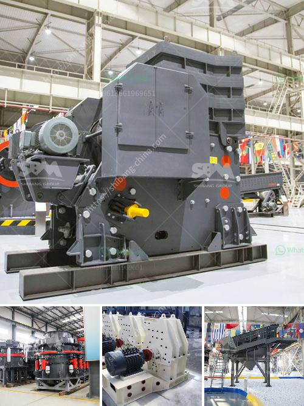

<h3>vibrating screens australia</h3>
In the modern world, efficiency is the key to success. The never-ending quest for greater productivity and profitability has led to the development of advanced technologies across various industries. One such innovation is the vibrating screen, which has become a critical component in many industrial processes.

At its core, a vibrating screen is a versatile tool that is commonly used to separate materials into different sizes for further processing. It works by using a combination of gravity, vibration, and centrifugal forces to separate the materials efficiently. This process ensures that the desired product size is achieved with minimal wastage.

Australia, known for its rich mineral resources, has witnessed a surge in demand for vibrating screens across the mining industry. With abundant reserves of key minerals such as iron ore, coal, bauxite, and gold, the country is a major player in the global mining industry. Vibrating screens are an integral part of this booming industry in Australia.

Also, vibrating screens are used in the recycling industry because of their ability to separate materials of different sizes effectively. This allows for the efficient recycling of materials such as plastics, glass, and paper, reducing waste and contributing to a more sustainable future.

Australia has a number of companies that specialize in the production and distribution of vibrating screens. These companies understand the unique requirements of the local market and strive to provide customized solutions to their customers. The screens they offer are known for their durability, high efficiency, and ease of maintenance.

In addition to their efficiency, vibrating screens also offer cost savings. By incorporating vibrating screens into their processes, companies can streamline their operations, reduce labor costs, and increase overall productivity. This makes them an attractive investment for businesses of all sizes.

Furthermore, these screens are designed to withstand the harsh conditions often encountered in mining and recycling operations. They are built to be durable, reliable, and resistant to wear and tear. This ensures that they can withstand the demands of heavy-duty applications and can operate continuously without interruption.

In conclusion, vibrating screens have become an essential tool for efficient screening in Australia's mining and recycling industries. Their ability to separate materials of different sizes accurately and efficiently has made them indispensable in these sectors. With their durability, cost savings, and customization options, vibrating screens have proven to be an excellent investment for businesses operating in Australia.
<h3>Contact us</h3><ul><li><strong>Whatsapp:&nbsp;<a href="https://wa.me/8613661969651">+8613661969651</a></strong></li><li><a href="https://swt.shibang-china.com/?git&amp;zhl&amp;vibrating screens australia"><strong>Online Service(chat now)</strong></a></li></ul><h3>Related</h3><ul><li><a href='company that work in crushing stones.md'>company that work in crushing stones</a></li><li><a href='stone crusher mobile plant di indonesia.md'>stone crusher mobile plant di indonesia</a></li><li><a href='cement plant production line.md'>cement plant production line</a></li><li><a href='china limestone jaw crusher machine.md'>china limestone jaw crusher machine</a></li><li><a href='station mobile de lavage de diamants.md'>station mobile de lavage de diamants</a></li></ul>