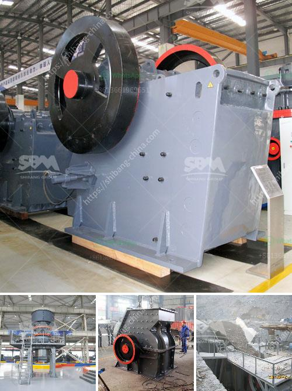

<h3>vibrating screens kenya</h3>
Vibrating screens have become an essential tool in various industries, providing efficient and effective screening solutions for numerous applications. In Kenya, vibrating screens are widely used in the mining industry, chemical industry, food processing, construction, and many other sectors.

The primary function of a vibrating screen is to separate materials selectively, ensuring desirable particle size distribution and efficient production processes. With the advancement in technology, modern vibrating screens feature high-quality materials and advanced mechanisms that provide accurate and reliable screening results.

One of the key advantages of vibrating screens is their versatility. They can be used for both wet and dry applications, making them suitable for a wide range of materials. Whether it's separating rocks and gravel in mining operations or sifting through fine powders in the chemical industry, vibrating screens in Kenya can handle various types of materials effectively.

Furthermore, vibrating screens contribute to the overall efficiency of the production process. By removing oversized and undersized particles, they enhance product quality and reduce waste. This leads to improved productivity and cost-effectiveness, ultimately benefiting companies in Kenya.

In addition to their functionality, vibrating screens also offer easy maintenance and installation. Many models are designed to be user-friendly, allowing for quick screen changes and adjustment of screening parameters. This convenience minimizes downtime and ensures smooth operations.

When selecting a vibrating screen, it is crucial to consider factors such as the desired screening capacity, material properties, and environmental conditions. Consulting with experienced suppliers in Kenya is essential to determine the most suitable vibrating screen for specific applications. These experts can guide businesses in choosing the right screen size, mesh type, and machine configuration.

In conclusion, vibrating screens play a vital role in various industries in Kenya. Their ability to efficiently separate and classify materials improves productivity, product quality, and overall cost-effectiveness. With the constant advancements in technology, investing in high-quality vibrating screens can significantly enhance operations in Kenya's diverse industrial sectors.
<h3>Contact us</h3><ul><li><strong>Whatsapp:&nbsp;<a href="https://wa.me/8613661969651">+8613661969651</a></strong></li><li><a href="https://swt.shibang-china.com/?git&amp;zhl&amp;vibrating screens kenya"><strong>Online Service(chat now)</strong></a></li></ul><h3>Related</h3><ul><li><a href='barite crusher price.md'>barite crusher price</a></li><li><a href='roller grinder mill manufacturers.md'>roller grinder mill manufacturers</a></li><li><a href='grinding mill installation operation.md'>grinding mill installation operation</a></li><li><a href='vertical roller mills manufacturer in india.md'>vertical roller mills manufacturer in india</a></li><li><a href='crusher supplier pakistan.md'>crusher supplier pakistan</a></li></ul>