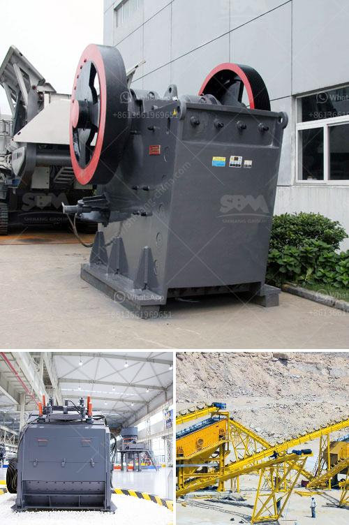

<h3>washing process for silica sand</h3>
Washing process of silica sand consists of three main stages: firstly, the breaking of the large particles into smaller particles by attrition, scrubbing, and crushing. Secondly, the removal of impurities such as iron and aluminum oxides by physical separation techniques including scrubbing, gravity separation, and magnetic separation. Finally, the drying and sieving of the washed sand to obtain the required particle size distribution.

The washing process begins with the breaking of large particles through attrition, where the sand particles are agitated with water and other materials in a rotating drum. This process helps in removing the surface contaminations and making the particles smaller, thus enhancing the washing efficiency. Additionally, physical actions such as scrubbing and crushing may be employed to break down any stubborn impurities or agglomerations.

After the initial attrition step, the next stage involves the separation of impurities. Iron and aluminum oxides are common impurities found in silica sand, and their presence can greatly affect the final sand quality. Gravity separation is often used to remove heavy impurities by means of water flow and density differences. The sand is passed through a series of water-filled tanks where the heavy impurities settle down, allowing for their removal.

Magnetic separation is another technique that can be employed to remove iron impurities from silica sand. Strong magnets are used to attract and separate the magnetic particles from the sand, leaving behind cleaner sand.

Once the impurities are removed, the washed sand is subjected to drying and sieving. The moisture content in the sand is reduced through the use of dryers, ensuring that the final product meets the required moisture specifications. The dried sand is then sieved to achieve the desired particle size distribution, ensuring that the sand meets the specific requirements for various applications.

In conclusion, the washing process of silica sand involves multiple stages to remove impurities and enhance the quality of the final product. This process not only helps in ensuring a clean and pure sand but also improves its suitability for various applications such as glass manufacturing, foundry molds, and construction materials. By understanding the washing process, silica sand producers can effectively produce high-quality sand that meets the demands of different industries.
<h3>Contact us</h3><ul><li><strong>Whatsapp:&nbsp;<a href="https://wa.me/8613661969651">+8613661969651</a></strong></li><li><a href="https://swt.shibang-china.com/?git&amp;zhl&amp;washing process for silica sand"><strong>Online Service(chat now)</strong></a></li></ul><h3>Related</h3><ul><li><a href='nigeria minerals processing company.md'>nigeria minerals processing company</a></li><li><a href='machines de crushine primaires.md'>machines de crushine primaires</a></li><li><a href='how much crusher machine.md'>how much crusher machine</a></li><li><a href='silica sand crusher rajasthan.md'>silica sand crusher rajasthan</a></li><li><a href='rock crushing equipment price.md'>rock crushing equipment price</a></li></ul>