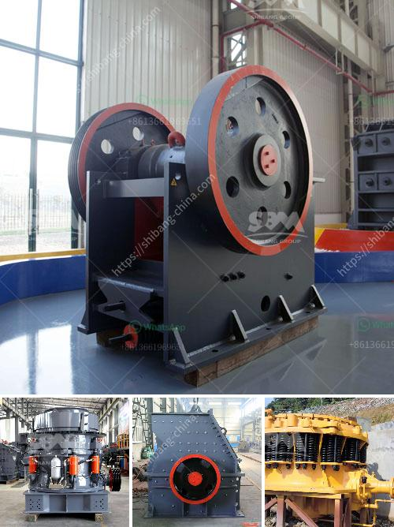

<h3>work of conveyor belts in peru</h3>
Conveyor belts play a crucial role in the industrial sector of Peru, facilitating the movement of goods and materials across various stages of production. With an ever-growing economy and an expanding industrial sector, the demand for conveyor belts in Peru has been on the rise.

From the mining industry to the agricultural sector, conveyor belts are widely utilized in almost every industrial segment. Peru is renowned for its rich mineral resources, being one of the world's leading producers of copper, silver, zinc, and gold. In mining operations, conveyor belts are extensively used to transport extracted minerals, rocks, and ores from the extraction sites to the processing plants. These belts not only enhance the efficiency of the mining process but also ensure the safety of workers by minimizing the need for manual handling.

The agricultural sector in Peru is also heavily reliant on conveyor belts for various purposes. In a country known for its diverse agricultural produce, conveyor belts are used in tasks such as moving harvested crops, sorting and grading fruits, and packaging agricultural goods. For instance, in Peru's banana plantations, conveyor belts are employed to transport bunches of bananas from the plantation to the packing area, ensuring a smooth and efficient process.

In addition to mining and agriculture, the manufacturing industry in Peru heavily relies on conveyor belts for production processes. From assembling and packaging to transportation and distribution, conveyor belts are used at each step to optimize workflow and productivity. These belts are designed to handle different types of goods, including bulk materials, heavy machinery parts, and delicate electronics. By automating the movement of materials, conveyor belts significantly reduce manual labor and the risk of workplace accidents, contributing to a safer and more efficient working environment.

The transportation sector also utilizes conveyor belts in various ways. Peru, being an important hub for logistics and transportation in South America, benefits greatly from the efficient movement of goods and materials. Conveyor belts are integrated into transportation systems such as airports and seaports to facilitate the loading and unloading of luggage and cargo containers, streamlining the overall logistics operations. Moreover, conveyor belts are used in warehouses, distribution centers, and postal services to sort and transfer packages, ensuring efficient and timely deliveries.

As the industrial sector in Peru continues to expand, the demand for conveyor belts is expected to grow further. With advancements in technology, conveyor belts are becoming more sophisticated, offering improved functionalities such as speed control, automated sorting, and real-time monitoring. This enables businesses in Peru to enhance their production processes, reduce operational costs, and increase overall productivity.

However, it's important to note that the increasing use of conveyor belts also brings environmental challenges. Conveyor belt systems require large amounts of energy to operate, which contributes to carbon emissions and energy consumption. To address this concern, Peruvian industries are adopting sustainable practices, such as using energy-efficient motors and recycling conveyor belt components. Additionally, alternative energy sources like solar power are being explored to minimize the environmental impact of conveyor belt operations.

In conclusion, conveyor belts play a vital role in various industries in Peru, facilitating the movement of goods and materials throughout the production process. From mining to agriculture, manufacturing to transportation, these belts contribute to increased efficiency, reduced labor requirements, and enhanced safety standards. As Peru's economy continues to grow, the demand for conveyor belts is expected to rise, prompting the industry to adopt more sustainable practices to minimize environmental impact.
<h3>Contact us</h3><ul><li><strong>Whatsapp:&nbsp;<a href="https://wa.me/8613661969651">+8613661969651</a></strong></li><li><a href="https://swt.shibang-china.com/?git&amp;zhl&amp;work of conveyor belts in peru"><strong>Online Service(chat now)</strong></a></li></ul><h3>Related</h3><ul><li><a href='ball mill price list philippines.md'>ball mill price list philippines</a></li><li><a href='ethiopia cone crusher for sale.md'>ethiopia cone crusher for sale</a></li><li><a href='build vibrating screen.md'>build vibrating screen</a></li><li><a href='ball mill manufacturers in india for lime limestone.md'>ball mill manufacturers in india for lime limestone</a></li><li><a href='fortius roller mill.md'>fortius roller mill</a></li></ul>