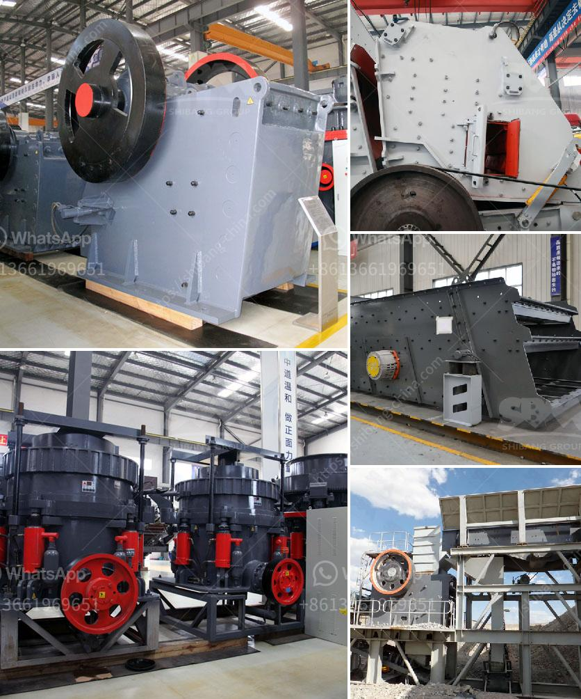

<h3>working principle structure of stone crusher</h3>
A stone crusher is a machine designed to reduce large rocks into smaller rocks, gravel, or rock dust. Crushers may be used to reduce the size, or change the form, of waste materials so they can be more easily disposed of or recycled, or to reduce the size of a solid mix of raw materials (such as in the mining industry), making different substances out of different grades and sizes for various purposes. 

The working principle of a stone crusher is simple and straightforward, yet efficient. The first step starts with separating the raw materials from the larger chunks of rocks using a rock separator or a vibrating screen. This process is essential for ensuring that the stone crushing equipment works efficiently and effectively to ensure high output and optimum performance. 

Once the raw materials are separated, they are transported to the primary crusher via a hopper. The primary crusher, also known as a jaw crusher, utilizes compressive force to crush materials between two jaw plates. One plate is fixed, while the other moves back and forth, providing the necessary crushing motion. 

The crushed materials then move to the secondary crusher, which is typically a cone crusher that further reduces the size of the stones. Cone crushers operate by squeezing the material between an eccentrically gyrating spindle and a concave and mantle, which are covered by a wear-resistant mantle. The resulting smaller-sized stones are then screened by a vibrating screen to separate the different sizes. 

The final product is obtained by transporting the stones to the tertiary crusher, which is typically a vertical shaft impactor (VSI) crusher. Here, the stones are further crushed and reshaped to achieve the desired specifications and shapes. The VSI crusher uses velocity rather than force to break rocks, resulting in a product that is cubical in shape and uniform in size. 

In conclusion, the working principle and structure of a stone crusher have been discussed. While the ultimate goal of the crushing process is to obtain the desired product, it is crucial to ensure that the machinery used works efficiently and effectively to maximize productivity and minimize downtime. Therefore, regular maintenance and inspection of all components are essential for optimal performance.
<h3>Contact us</h3><ul><li><strong>Whatsapp:&nbsp;<a href="https://wa.me/8613661969651">+8613661969651</a></strong></li><li><a href="https://swt.shibang-china.com/?git&amp;zhl&amp;working principle structure of stone crusher"><strong>Online Service(chat now)</strong></a></li></ul><h3>Related</h3><ul><li><a href='hammer mill h 300 tph.md'>hammer mill h 300 tph</a></li><li><a href='5mm limestones grinding to powder.md'>5mm limestones grinding to powder</a></li><li><a href='mobile stone crusher from taiwan.md'>mobile stone crusher from taiwan</a></li><li><a href='jaw crusher size and capacity.md'>jaw crusher size and capacity</a></li><li><a href='ball mill for sale in china.md'>ball mill for sale in china</a></li></ul>