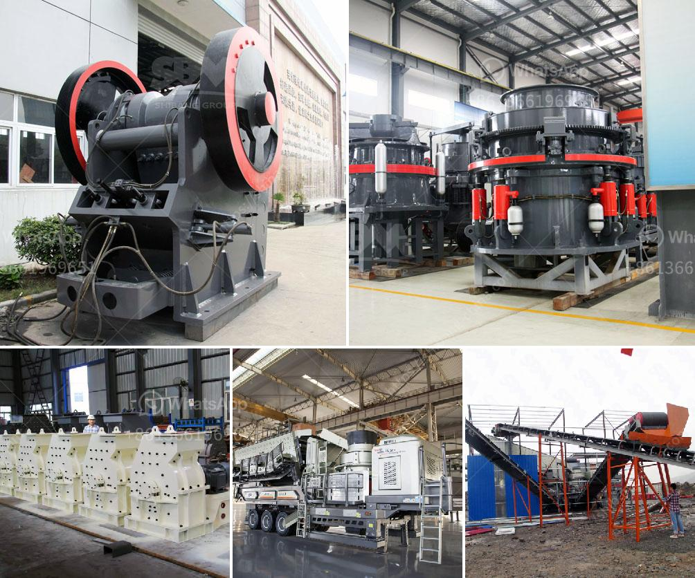

<h3>xzm ultrafine grinding mill</h3>
When it comes to grinding large quantities of materials into ultra-fine particles, traditional grinding mills fall short. However, the XZM Ultrafine Grinding Mill offers a revolutionary approach to fine grinding, making it the go-to solution for industries looking to achieve exceptional results.

The XZM Ultrafine Grinding Mill is specifically designed for particles ranging from 200 to 2500 mesh (5 microns to 45 microns) in size. This versatile mill can effectively grind diverse materials such as limestone, calcite, marble, talc, graphite, dolomite, zeolite, and more.

One of the key advantages of the XZM Ultrafine Grinding Mill is its advanced grinding technology. Equipped with a high-speed rotational analyzer, it precisely controls the particle size and ensures a more uniform product distribution. This cutting-edge technology allows for the production of ultra-fine particles without sacrificing quality or efficiency.

Another standout feature of the XZM Ultrafine Grinding Mill is its robust structure and high capacity. The mill is constructed using premium quality materials, making it durable and long-lasting. Additionally, its high-capacity design enables it to handle large volumes of materials, significantly enhancing productivity and reducing processing time.

The XZM Ultrafine Grinding Mill is also known for its low energy consumption. This eco-friendly mill is designed to minimize energy usage without compromising its exceptional performance. By utilizing advanced technology, it efficiently grinds materials to the desired particle size, resulting in reduced energy consumption and optimized operational costs.

Not only does the XZM Ultrafine Grinding Mill excel in performance, but it also prioritizes user convenience. The mill features an intuitive control system that allows operators to easily adjust parameters and control the grinding process, ensuring precise results every time.

In conclusion, the XZM Ultrafine Grinding Mill is a game-changer in the field of fine grinding. With its advanced technology, robust structure, high capacity, low energy consumption, and user-friendly design, it offers the perfect solution for industries seeking to achieve ultra-fine particle sizes. Whether it's in the pharmaceutical, chemical, mining, or construction industry, this mill sets a new benchmark in grinding efficiency and product quality.
<h3>Contact us</h3><ul><li><strong>Whatsapp:&nbsp;<a href="https://wa.me/8613661969651">+8613661969651</a></strong></li><li><a href="https://swt.shibang-china.com/?git&amp;zhl&amp;xzm ultrafine grinding mill"><strong>Online Service(chat now)</strong></a></li></ul><h3>Related</h3><ul><li><a href='100tph vibratory feeder.md'>100tph vibratory feeder</a></li><li><a href='rubber grinder machine in philippines.md'>rubber grinder machine in philippines</a></li><li><a href='stone crushing equipment.md'>stone crushing equipment</a></li><li><a href='thailand coconut processing machine.md'>thailand coconut processing machine</a></li><li><a href='crusher for road base blue metal.md'>crusher for road base blue metal</a></li></ul>